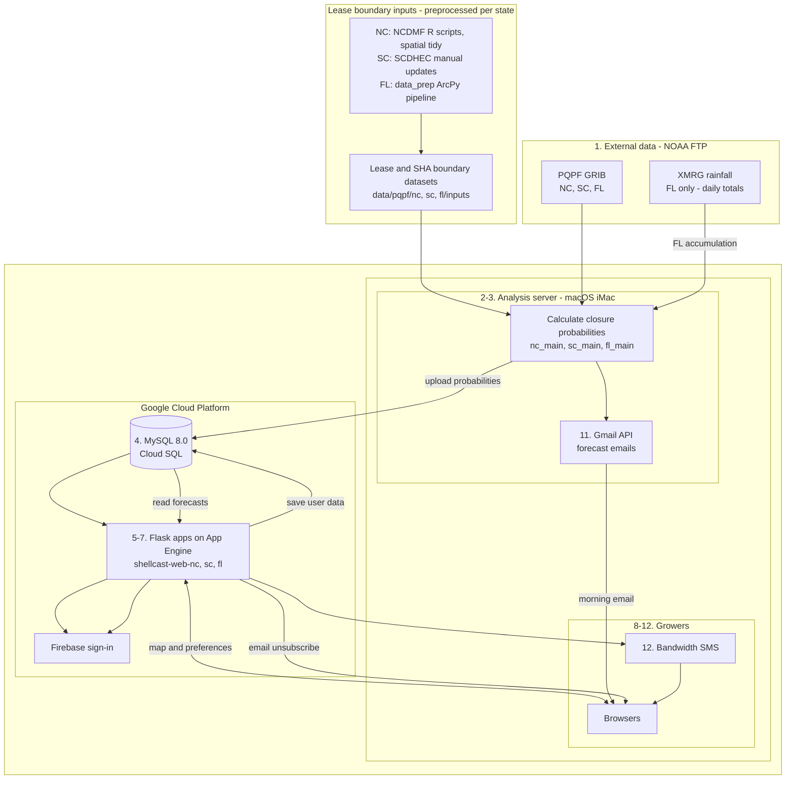
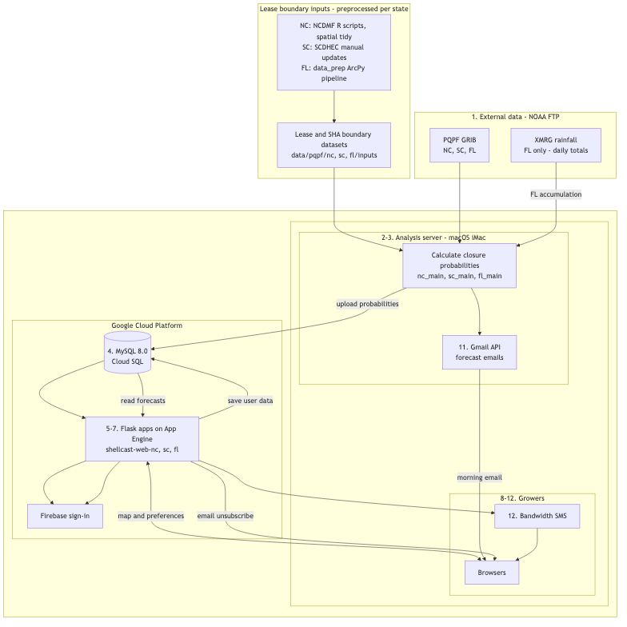

# ShellCast

ShellCast is a Python Flask web application that helps North Carolina shellfish growers make harvesting decisions based on predicted rainfall. The live production version of the app can be found at [https://go.ncsu.edu/shellcast](https://go.ncsu.edu/shellcast). A public version of this repository is also available at https://github.com/Biosystems-Analytics-Lab/shellcast.

**New here?** Fork/clone, pre-commit, and running analysis or web locally: [GETTING_STARTED.md](GETTING_STARTED.md).

Please note that this repository is participating in a study into sustainability of open source projects. Data will be gathered about this repository for approximately the next 12 months, starting from May 17, 2021.

Data collected will include number of contributors, number of PRs, time taken to close/merge these PRs, and issues closed.

For more information, please visit [our informational page](https://sustainable-open-science-and-software.github.io/) or download our [participant information sheet](https://sustainable-open-science-and-software.github.io/assets/PIS_sustainable_software.pdf).

## Table of Contents

1. [Folders](#1-folders)
2. [Third-Party Services](#2-third-party-services)
3. [Architecture Overview](#3-architecture-overview)
4. [Documentation Overview](#4-documentation-overview)
5. [Contact Information](#5-contact-information)

## 1. Folders

- **analysis** - Contains all of the code related to calculating probabilities and uploading them to the database. This code is logically separate from the rest of the codebase and runs on a dedicated production host (macOS iMac). For more information see [docs/analysis/README.md](docs/analysis/README.md) and [analysis/README.md](analysis/README.md).
- **analysis/shellcast-analysis/db_scripts** - SQL scripts to set up or inspect the database.
- **docs** - Documentation for ShellCast (analysis guides, web guides, database, citation).
- **web** - Code for the web application, hosted on Google App Engine.
  - **shellcast-web-fl** - ShellCast web for FL
  - **shellcast-web-nc** - ShellCast web for NC
  - **shellcast-web-sc** - ShellCast web for SC

## 2. Third-Party Services

Various third-party services are used as part of the ShellCast web app.

Google Cloud Platform

- App Engine - The web app is deployed on Google App Engine in a standard Python 3 environment.
- Cloud SQL - ShellCast uses a **MySQL 8.0** database for storing all persistent information. The database is managed by Google Cloud SQL.
- Logging - All logs related to the App Engine and Cloud SQL instances are recorded with Google Logging. Additional custom logs from within the app itself are also recorded.
- Firebase
  - Authentication - ShellCast uses Firebase authentication to manage user signup and login.

Notifications

- **Gmail API** — Morning **forecast emails** are sent from the **analysis** server (`shellcast-analysis`) after each state’s daily run. See [docs/analysis/06-NOTIFICATIONS_ANALYSIS.md](docs/analysis/06-NOTIFICATIONS_ANALYSIS.md).
- **Bandwidth** — **SMS** text alerts are sent from the **web** apps (NC orchestrates delivery and callback logging for all states). See [docs/web/03-NOTIFICATIONS.md](docs/web/03-NOTIFICATIONS.md).

GitHub (source code)

- Repository: [https://github.com/Biosystems-Analytics-Lab/shellcast](https://github.com/Biosystems-Analytics-Lab/shellcast)
- Clone, fork, pre-commit, and local run: [GETTING_STARTED.md](GETTING_STARTED.md)

## 3. Architecture Overview

```mermaid
flowchart TB
  subgraph external ["1. External data - NOAA FTP"]
    PQPF["PQPF GRIB<br/>NC, SC, FL"]
    XMRG["XMRG rainfall<br/>FL only - daily totals"]
  end

  subgraph spatial ["Lease boundary inputs - preprocessed per state"]
    PREP["NC: NCDMF R scripts, spatial tidy<br/>SC: SCDHEC manual updates<br/>FL: data_prep ArcPy pipeline"]
    INPUTS["Lease and SHA boundary datasets<br/>data/pqpf/nc, sc, fl/inputs"]
    PREP --> INPUTS
  end

  subgraph core [" "]
    direction LR
    subgraph left [" "]
      direction TB
      subgraph analysis ["2-3. Analysis server - macOS iMac"]
        AN["Calculate closure probabilities<br/>nc_main, sc_main, fl_main"]
        GMAIL["11. Gmail API<br/>forecast emails"]
        AN --> GMAIL
      end
      subgraph users ["8-12. Growers"]
        BROWSER["Browsers"]
        SMS["12. Bandwidth SMS"]
      end
    end
    subgraph gcp ["Google Cloud Platform"]
      DB[("4. MySQL 8.0<br/>Cloud SQL")]
      WEB["5-7. Flask apps on App Engine<br/>shellcast-web-nc, sc, fl"]
      FB["Firebase sign-in"]
      DB --> WEB
      WEB --> FB
    end
  end

  INPUTS --> AN
  PQPF --> AN
  XMRG -->|FL accumulation| AN
  AN -->|upload probabilities| DB
  DB -->|read forecasts| WEB
  WEB <-->|map and preferences| BROWSER
  WEB -->|save user data| DB
  WEB --> FB
  GMAIL -->|morning email| BROWSER
  WEB -->|email unsubscribe| BROWSER
  WEB --> SMS
  SMS --> BROWSER
```

If the diagram above is blank in your editor, open **Markdown preview** (in Cursor/VS Code: preview pane, not the raw `.md` tab) or view this file on GitHub. Static copy:

**Flow summary**

1. **External data** — NOAA **PQPF** (all states) and **XMRG** daily rainfall (**Florida only**). See [docs/analysis/03-STATE_GUIDES.md](docs/analysis/03-STATE_GUIDES.md) and [09-ANALYSIS.md](docs/analysis/09-ANALYSIS.md) §3.2.
2. **Lease boundary inputs** — Each state maintains **preprocessed** lease and SHA boundary data (shapefiles under `data/pqpf/{nc,sc,fl}/inputs/`). NC uses NCDMF/NCDEQ workflows (R tidy scripts); SC is updated manually from SCDHEC; FL is built with `data_prep/fl/` (ArcPy) when boundaries or seasonality change. See [docs/analysis/04-DATA_PREP_README.md](docs/analysis/04-DATA_PREP_README.md) and [09-ANALYSIS.md](docs/analysis/09-ANALYSIS.md) §3.3.
3. **Analysis** — The production iMac runs `nc_main`, `sc_main`, and `fl_main`, combining those inputs with daily weather data to compute closure probabilities. See [docs/analysis/README.md](docs/analysis/README.md).
4. **Database** — Results are written to **MySQL 8.0** on Cloud SQL. See [docs/DATABASE.md](docs/DATABASE.md).
5. **Web** — State Flask apps on App Engine read the database and serve the map and account UI. See [docs/web/README.md](docs/web/README.md).
6. **Users** — Growers use ShellCast in a browser; preferences and lease choices are stored in Cloud SQL.
7. **Notifications** — Morning **email** via **Gmail API** (analysis); **SMS** via **Bandwidth** (web, NC orchestrates all states). See [docs/analysis/06-NOTIFICATIONS_ANALYSIS.md](docs/analysis/06-NOTIFICATIONS_ANALYSIS.md) and [docs/web/03-NOTIFICATIONS.md](docs/web/03-NOTIFICATIONS.md).

## 4. Documentation Overview

Instructions explaining how to perform a variety of tasks can be found in the following documents.

- [GETTING_STARTED.md](GETTING_STARTED.md) — fork or clone, pre-commit, run analysis or web locally
- [docs/analysis/README.md](docs/analysis/README.md) — numbered analysis guides (`01-` … `09-`); [09-ANALYSIS.md](docs/analysis/09-ANALYSIS.md) has PQPF specs, compile steps, and cron setup detail
- [docs/CITATION.md](docs/CITATION.md) — how to cite and give attribution to ShellCast source code
- [docs/DATABASE.md](docs/DATABASE.md) — access, manage, and interact with the ShellCast database
- [LICENSE.md](LICENSE.md) — ShellCast license
- [docs/web/README.md](docs/web/README.md) — numbered web guides (`01-` … `07-`); [07-WEB_REFERENCE.md](docs/web/07-WEB_REFERENCE.md) has detailed legacy setup
- [docs/analysis/06-NOTIFICATIONS_ANALYSIS.md](docs/analysis/06-NOTIFICATIONS_ANALYSIS.md) — Gmail API forecast email (analysis)
- [docs/web/03-NOTIFICATIONS.md](docs/web/03-NOTIFICATIONS.md) — Bandwidth SMS and email unsubscribe (web)

## 5. Contact Information

If you have any questions, feedback, or suggestions please submit [GitHub issues](https://github.com/Biosystems-Analytics-Lab/shellcast/issues). You can also reach out to Makiko Shukunobe (mshukun at ncsu dot edu) or Natalie Nelson (nnelson4 at ncsu dot edu).
