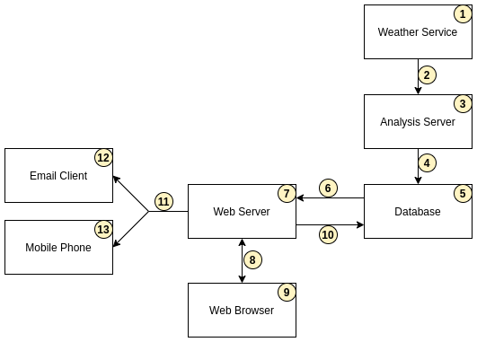

# ShellCast
ShellCast is a Python Flask web application that helps North Carolina shellfish growers make harvesting decisions based on predicted rainfall.  The live production version of the app can be found at [https://go.ncsu.edu/shellcast](https://go.ncsu.edu/shellcast).

## Third-party Services
Various third-party services are used as part of the ShellCast web app.

Google Cloud Platform
- App Engine - The web app is deployed on Google App Engine in a standard Python 3 environment.
- Cloud SQL - ShellCast uses a MySQL database for storing all persistent information.  The database is managed by Google Cloud SQL.
- Logging - All logs related to the App Engine and Cloud SQL instances are recorded with Google Logging.  Additional custom logs from within the app itself are also recorded.
- Firebase
  - Authentication - ShellCast uses Firebase authentication to manage user signup and login.

Google
- Maps API - ShellCast uses the Google Maps JavaScript API for displaying a map of the North Carolina coast with an overlay of the NCDMF growing areas and user leases.

Amazon Web Services
- Simple Email Service - ShellCast uses AWS SES to send closure notifications to users through email and text.

NCSU Virtual Computing Lab (VCL)
- Available through https://vcl.wordpress.ncsu.edu/
- Linux Server - ShellCast uses a custom Linux server to run the closure analysis code on a regular basis.

## Architecture Overview

1. The NC Climate Office provides APIs for a variety of weather data.
2. Rainfall forecasts are retrieved every morning.
3. The analysis server calculates closure probabilities for growing units based on the rainfall forecasts and rainfall closure thresholds for those growing units. See [docs/ANALYSIS.md](/docs/ANALYSIS.md) for more information.
4. The calculated probabilities for every growing unit are uploaded to the database every morning.
5. The database is a MySQL 5.7 instance hosted on Google Cloud SQL. See [docs/DATABASE.md](/docs/DATABASE.md) for more information.
6. Calculated probabilites are retrieved by the web server 
7. The web server is a Python Flask application hosted on Google App Engine. See [docs/DEVELOPER.md](/docs/DEVELOPER.md) for more information.
8. As requests are made from a web browser, the web server responds to those requests.
9. A user can access the ShellCast web site using any modern web browser on a computer, phone, or tablet.
10. User information and preferences are propagated back to the database.
11. Notifications are sent to users every morning based on their notification preferences. Notifications are sent using Amazon Web Services Simple Email Service.
12. Email notifications show a detailed list of a user's leases that may close soon. Email notifications are sent using the user's email address.
13. Text notifications consist of a short message with a link back to ShellCast site. Text notifications are sent using the user's phone number and the SMS gateway for the user's phone service provider.

## Documentation
Instructions explaining how to perform a variety of tasks can be found in the following documents in the `doc` directory [here](https://github.ncsu.edu/biosystemsanalyticslab/shellcast/tree/master/docs).

- [docs/ANALYSIS.md](/docs/ANALYSIS.md) explains the various analysis scripts and how to set up the analysis cron job on a virtual computing lab image.
- [docs/CITATION.md](/docs/CITATION.md) explains how to cite and give attribution to ShellCast source code.
- [docs/DATABASE.md](/docs/DATABASE.md) explains how to access, manage, and interact with the ShellCast database.
- [docs/DEVELOPER.md](/docs/DEVELOPER.md) explains the structure of the repository, how to setup a full development environment, and how to perform common development tasks.
- [docs/LICENSE.md](/docs/LICENSE.md) explains the ShellCast license.
- [docs/MANUAL_UPDATES.md](/docs/MANUAL_UPDATES.md) explains how to make simple updates to ShellCast.

