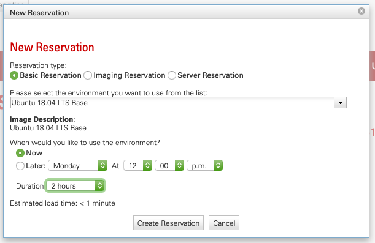
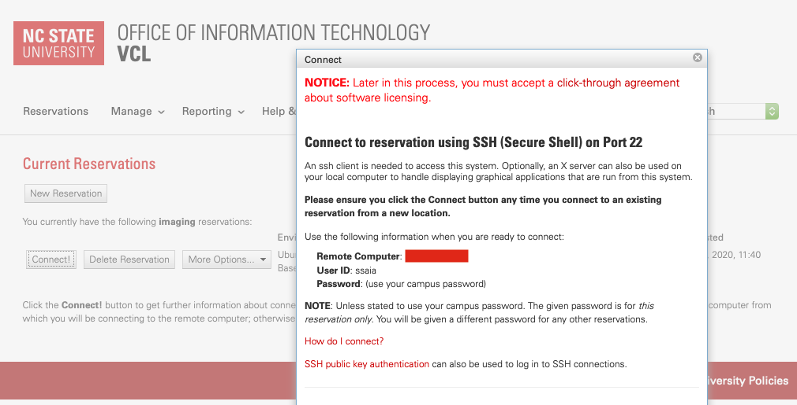
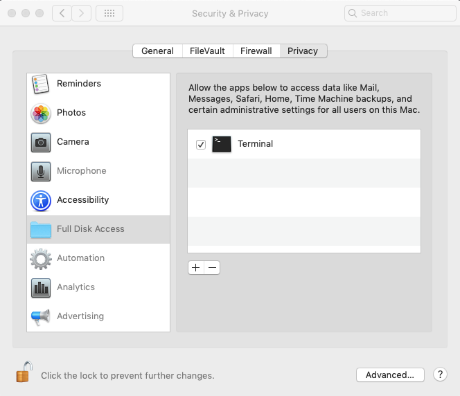

# ANALYSIS.md

This markdown file describes the components and set up of the daily analysis CRON job that updates the ShellCast web application at [https://go.ncsu.edu/shellcast](https://go.ncsu.edu/shellcast).

## Table of Contents

0. [Background](#0-background)

1. [List of Acronyms](#1-list-of-acronyms)

2. [Description of Analysis scripts](#2-description-of-analysis-scripts)

3. [VCL Set Up](#3-vcl-set-up)

4. [CRON Job Set Up](#4-cron-job-set-up)

5. [CRON Job Script Run Order](#5-cron-job-script-run-order)

6. [Description of CRON Job Outputs](#6-description-of-cron-job-outputs)

7. [Pushing Changes to GitHub](#7-pushing-changes-to-github)

7. [Contact Information](#8-contact-information)

## 0. Background

The main purpose of the scripts in the analysis folder are to: (1) pull rainfall data from a remote server at the North Carolina State Climate Office, (2) do some calculations with that rainfall data, and (3) update the ShellCast MySQL database based on those calculations. For a schematic representation of this workflow, including the how they relate to other major components of the ShellCast web application, see the ShellCast [architecture overview flowchart](/../../#2-architecture-overview).

The analysis daily CRON job ensures that the three steps descirbed above will run every day at 6am ET on the virtual computing lab server (or on a personal machine).

**NOTE:** At this point in time (i.e., 2020-12-18) the analysis is running on a personal computer and also the analysis weekly CRON job is not functional because the North Carolina Division of Marine Fisheries lease app REST API is not finalized/functional. Once it is, ShellCast will require a second (weekly) CRON job that will update shellfish lease information, which is required when running the rainfall calculations script (see step number 2 above).

## 1. List of Acronyms

- North Carolina State University (NCSU)
- North Carolina Division of Marine Fisheries (NCDMF)
- National Digital Forecast Dataset (NDFD)
- North Carolina State Climate Office (SCO)
- Virtual Computing Lab (VCL)
- Google Cloud Platform (GCP)

## 2. Description of Analysis Scripts

1. `ndfd_get_forecast_data_script.py` - This script gets the NDFD .bin file from the SCO server and converts it to a pandas dataframe. This script is run daily.

2. `ndfd_convert_df_to_raster_script.R` - This script converts the NDFD pandas dataframe to a raster object that is used for downstream R analysis. This script is run daily.

3. `ndfd_analyze_forecast_data_script.R` - This script takes the raster object as well as other spatial information about the NC coast (shellfish growing area boundaries, conditional management boundaries, lease boundaries, etc.) and does calculations for each scale so they can be used to update the ShellCast MySQL database. This script is run daily.

4. `gcp_update_mysqldb_script.py` - This script takes the data outputs from the analysis script and pushes them to the ShellCast MySQL database. This script is run daily.

5. `ncdmf_tidy_sga_data_script.R` - This script takes the NCDFM shellfish growing area boundaries spatial dataset and cleans it up for use with the analysis script listed above (number 3). This script is run annually when shellfish growing areas change.

6. `ncdmf_tidy_cmu_bounds_script.R` - This script takes the NCDFM conditional management unit boundaries spatial dataset and cleans it up for use with the analysis script listed above (number 3). This script is run annually when conditional management units change.

7. `ncdmf_get_lease_data_script.R` - This script is not yet included but will be created when the NCDMF finalizes the REST API for its publicly available lease dataset. This dataset is available in a viewer tool [here](https://www.arcgis.com/apps/webappviewer/index.html?id=de86f3bb9e634005b12f69a8a5947367&extent=-8551979.8781%2C4121555.1994%2C-8515290.1046%2C4140072.0696%2C102100). This script will run weekly to incorporate changes to leases made by NCDFM.

8. `ncdmf_tidy_lease_data_script.R` - This script takes the NCDFM shellfish lease boundaries spatial dataset and cleans it up for use with the analysis script listed above (number 3). This script will run weekly when conditional management units change.

**NOTE:** Scripts 1 through 4 are run daily while scripts 5 through 8 are run periodically (weekly or annually, depending on the script). See full script descriptions for specific timing details.

## 3. VCL Set Up

**THIS DOCUMENTATION SECTION IS STILL IN PROGRESS.**

Setting up the VCL using NCSU computing resources frees up use of a work machine and also ensures more consistent working conditions because the work machine doesn't have to be constantly on to run. There are two major steps to setting up the analysis CRON job on a VCL machine: (1) create the image and (2) launch the image as a server.

### 3.1 Creating the VCL Image

Go to [VCL at NCSU](https://vcl.ncsu.edu/), click on "Reservations" and login using your Unity ID and password. After login in, click on "Reservations" again and then "New Reservation". A window will pop up and you want to select "Imaging Reservation" with Ubuntu 18.04 LTS Base and choose "Now" and a duration that's appropriate for set up--at least 1 to 3 hours is recommended (**Figure 1.**). Then click "Create Reservation". You will need to wait a few minutes while this image is created. Click on "Connect!" and you will see a pop up window with more information on how to connect (**Figure 2.**). Then you will need to copy the ip address of the image for use in the next step.


<br> **Figure 1.** New VCL image reservation options.


<br> **Figure 2.** VCL image IP information.

Once you created the image and have an IP address, open up a new terminal window, and follow the following steps.

```{bash}
# 1. secure connect to the VCL image using <your unity ID>@<the IP address>
ssh unityid@ip

# 2. download Mini Conda 3
wget https://repo.anaconda.com/miniconda/Miniconda3-latest-Linux-x86_64.sh

# 3. execute Mini Conda 3 download
bash Miniconda3-latest-Linux-x86_64.sh

# 4. exit out of environment using XXXX and secure connect back in using step 1

# 5. clone the shellcast repo into the image
git clone https://github.ncsu.edu/biosystemsanalyticslab/shellcast.git

# 6. go into the shellcast directory
cd shellcast

# 7. track and checkout the vcl branch
git checkout --track origin/vcl

# 8. if step 7 doesn't work then run this step and try step 7 again
git fetch --all

# 9. return to the home directory
cd

# 10. copy the shellcast environment yaml set up file into the home directory
cp shellcast/analysis/shellcast-env.yml shellcast-env.yml

# 11. use conda to create an environment based on the requirements in the shellcast environmental yaml file  
conda env create --prefix /home/ssaia/env_shellcast -f shellcast-env.yml
# The user will have to replace "ssaia" with their Unity ID.

# 12. activate the environment you created
conda activate /home/ssaia/env_shellcast
# The user will have to replace "ssaia" with their Unity ID.

# 13. nativate into the shellcast directory
cd shellcast

# 13. copy the Python config file template into the analysis directory
cp config-template.py ./analysis/config.py

# 14. navigate into the analysis directory and fill in the missing parts of the config.py file using nano
cd analysis
nano config.py

**THIS DOCUMENTATION SECTION IS STILL IN PROGRESS.**
```

### 3.2 Creating the VCL Server Reservation

**THIS DOCUMENTATION SECTION IS STILL IN PROGRESS.**

## 4. CRON Job Set Up

If VCL options are not available, the CRON job can be set up on a work computer. This case applies to a Mac machine running macOS Mojave version 10.14.6 with a 2.3 GHz Intel Core i5 processor, 16 GB 2133 MHz DDR4 memory, and Intel Iris Plus Graphics 640 1536 MB graphics card.

To set up the CRON job on the work Mac, there are two main steps: (1) setting up GCP credentials so the ShellCast MySQL database can be updated daily via the Python script and (2) scheduling the CRON job.


### 4.1 Setting Up GCP Credentials

Run the code below in the command line. You're web browser will pop open and you'll need to give permission to sign into the email account associated with your account on the ShellCast GCP project. You will need administrator privledges with the ShellCast web application to update the MySQL database.

```{bash}
gcloud auth application-default login
```
Copy the location of the json credential file and keep that in a safe location in case you need it later. It will look something like "/Users/sheila/.config/gcloud/application_default_credentials.json".

**THIS DOCUMENTATION SECTION IS STILL IN PROGRESS.**

### 4.2 Scheduling the CRON Job on a Personal Machine (i.e., a Mac)

The daily CRON job uses Mac's `launchd` program, which should be already installed, and will run each day at 6am as long as the work/host computer is powered on and the CRON job script is still loaded. Text and email notifications are sent out at 7:00am ET by the GCP CRON job. There are several steps to scheduling the CRON job on a mac.

First, you need to give the terminal permission to run the script. On the Mac, go to `Settings > Security & Privacy`. Click on `Full Disk Access` on the left list and go to the `Privacy` tab (**Figure 3.**). Add `Terminal` (in `Applications > Utilities`) to this list. To save this you will have to sign in as an administrator to the machine you're working on. Be sure to lock the administrator privileges before you close the Settings window.


<br> **Figure 3.** Full Disk Access Settings window for a Mac.

Next, running a CRON job with the `launchd` program requires a correctly formatted plist file (here, `com.shellcast.dailyanalysis.cronjob.plist`). This [blog post by Cecina Babich Morrow](https://babichmorrowc.github.io/post/launchd-jobs/) was especially helpful and the official documentation is [here](https://www.launchd.info/). If you need help debugging the plist script, [LaunchControl](https://www.soma-zone.com/LaunchControl/) is a helpful app for finding errors using the trail version.

Next, the bash (.sh) script you're running in the CRON job and all the other Python and R scripts that run within the bash script have to be executable. Check to see that they are executable from the terminal window using `ls -l`. You should see "x"s in the far left column for each file (e.g., "-rwxr-xr-x"). If it's no executable (e.g., "-rw-r--r--"), then use `chmod` to make each of them executable.

```{bash}
# make a script executable
chmod +x shellcast_daily_analysis.sh
```

If needed, repeat this use of `chmod` for each of the Python and R scripts listed below in "CRON Job Script Run Order". All of them need to be executable.

**Note:** I've (Sheila) successfully run the CRON job without the plist file being executable.

Next, when you're ready to run the CRON job, do the following:

In the terminal, navigate to the LaunchAgents directory.

```{bash}
cd ~/Library/LaunchAgents
```

Then if the plist file is not there, copy it to this location.

```{bash}
# make sure to change the "..." to the full path
# cp .../analysis/com.shellcast.dailyanalysis.cronjob.plist com.shellcast.dailyanalysis.cronjob.plist

# it will look something like this:
# cp /Users/sheila/Documents/github_ncsu/shellcast/analysis/com.shellcast.dailyanalysis.cronjob.plist com.shellcast.dailyanalysis.cronjob.plist
```

Then check that you're working with the right plist file using nano.

```{bash}
nano com.shellcast.dailyanalysis.cronjob.plist
```

Or with atom.

```{bash}
atom com.shellcast.dailyanalysis.cronjob.plist
```

Then load the CRON job, run the following in the LaunchAgents directory.

```{bash}
launchctl load com.shellcast.dailyanalysis.cronjob.plist
```

To stop the CRON job, run the following in the LaunchAgents directory.

```{bash}
launchctl unload com.shellcast.dailyanalysis.cronjob.plist
```

To see if a LaunchAgent is loaded you can use the following.
```{bash}
launchctl list
```

Also, you can go to `Applications > Utilities > Console` and then look at system log to see current loaded and active programs.

Last, if you need help debugging the plist script, [LaunchControl](https://www.soma-zone.com/LaunchControl/) is a helpful app for finding errors using the trial version.

If debugging, you can open up LaunchControl to check that that plist file is unloaded. Change the time in the plist file, load it, wait, and then check LaunchControl for status. Sometimes the errors in LaunchControl are not helpful (e.g., "Error 1") but other times it will tell you if you need to make the bash script executable. When in down you might have a process running from a previous time you tried to run the script that you have to kill. To do this use htop. Search within htop for "sql" and kill the process. Then start again with checking to make sure the script is unloaded, reload it, wait, etc. It's a little tedious...typical debugging.

### 4.3 Other Debugging

If you're having issues with the CRON job running, you can also try running the bash script on its own and checking if a particular script it giving issues.

To run the bash script (.sh) not in a CRON job (for debugging), use the code below. This must be run from the analysis directory. Outputs from each R and Python script will be saved into the terminal\_data directory.

The bash (.sh) script as well as so all the other Python and R scripts that run within the bash script have to be executable. Check to see that they are executable from the terminal window using `ls -l`. You should see "x"s in the far left column for the file (e.g., "-rwxr-xr-x"). If it's no executable (e.g., "-rw-r--r--"), then use `chmod` to make it executable.

```{bash}
chmod +x shellcast_daily_analysis.sh
```

If needed, repeat this use of `chmod` for each of the Python and R scripts listed below in "CRON Job Script Run Order".

To run the bash script, open the terminal in the analysis directory and type the following:

```{bash}
sh shellcast_daily_analysis.sh

# for debugging
# sh shellcast_daily_analysis_debug.sh
```

## 5. CRON Job Script Run Order

Each day the `shellcast_daily_analysis.sh`, which is called in the `launchcd` plist file, will run the following R and Python scripts in the order noted below. For a description of each script see the [script description section above](#2-description-of-analysis-scripts).

1. `ndfd_get_forecast_data_script.py`

2. `ndfd_convert_df_to_raster_script.R`

3. `ndfd_analyze_forecast_data_script.R`

4. `gcp_update_mysqldb_script.py`

## 6. Description of CRON Job Outputs

**THIS DOCUMENTATION SECTION IS STILL IN PROGRESS.**

## 7. Pushing Changes to GitHub

When appropriate, changes need to be pushed to the NCSU Enterprise GitHub repository **as well as** the GitHub (public) respository as described in the [DEVELOPER.md documentation](/docs/DEVELOPER.md).

## 8. Contact Information

If you have any questions, feedback, or suggestions please submit an issue [through NCSU GitHub](https://github.ncsu.edu/biosystemsanalyticslab/shellcast/issues) or [through GitHub (public)](https://github.com/Biosystems-Analytics-Lab/shellcast/issues). You can also reach out to Sheila Saia (ssaia at ncsu dot edu) or Natalie Nelson (nnelson4 at ncsu dot edu).
