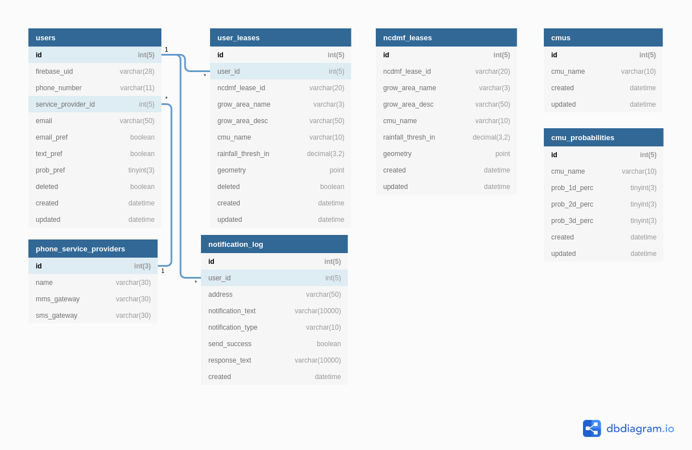

# DATABASE.md

This document is intended to help a developer understand the ShellCast database structure and make changes to the database.

_The following instructions assume that you are using [Sequel Pro](https://sequelpro.com/) as your database client.  Unfortunately, Sequel Pro is only available on Mac, however, you should be able to use any database client to access the database by following the instructions under [Connecting to Cloud SQL](#2-connecting-to-google-cloud-sql).  A powerful alternative to Sequel Pro is [DBeaver](https://dbeaver.io/) which is free, open source, and multiplatform._

## Table of Contents

1. [Database Design](#1-database-design)

2. [Connecting to Google Cloud SQL](#2-connecting-to-google-cloud-sql)

3. [Downloading Database Tables](#3-downloading-database-tables)

4. [Editing User Information and Leases](#4-editing-user-information-and-leases)

5. [Contact Information](#5-contact-information)

## 1. Database Design

ShellCast uses a MySQL 5.7 instance hosted on Google Cloud SQL.

There are 6 tables.
- users
  - Stores information about users.
  - User accounts and authentication are mainly handled by Firebase.  In our database, we simply create a user record when a new user registers through Firebase and store the Firebase UID in the record along with other information.
- user_leases
  - Stores the leases that users have added to their accounts.
  - Leases are associated with a particular user.  If two users create two of the exact same leases, then they will still be stored as two different records in the database.
- ncmdf_leases
  - Stores all of the leases registered with the North Carolina Division of Marine Fisheries (NCDMF).  These are the leases that users can search for in the application and then add to their accounts.
  - The records in this table are "manually" added and should be updated periodically.  There were intentions to automate the retrieval of leases directly from NCDMF's database on a regular basis, but this has not been set up.
- cmus
  - Stores the NCDMF conditional management units (CMU).
- cmu_probabilities
  - Stores calculated closure probabilities for each CMU.
  - These probabilities are calculated and added to the database on a daily basis.  The probability for the CMU that a given lease belongs to is also the probability for that lease.
- notification_log
  - Stores a log of all notifications that are sent to users.
  - Each notification is associated with a user that the notification is sent to as well as the closure probability that triggered the notification.

There are 3 "databases" in the MySQL instance: `shellcast`, `shellcast_dev`, and `shellcast_testing`.  `shellcast` is the production database that the live, public site uses.  `shellcast_dev` is the development database that is used when running the application on a local machine.  `shellcast_testing` is a database that is used for running the unit tests for the application.  `shellcast_testing` is wiped clean after every test.

## 2. Connecting to Google Cloud SQL

1. Complete the [Install and initialize Google Cloud SDK](DEVELOPER.md#41-install-and-initialize-google-cloud-sdk) section in the [docs/DEVELOPER.md](/docs/DEVELOPER.md) documentation.
2. Complete the [Download Cloud SQL proxy](DEVELOPER.md#42-download-cloud-sql-proxy) section in the [docs/DEVELOPER.md](/docs/DEVELOPER.md) documentation.
3. Start a TCP connection by running the first command in the [Use the Cloud SQL proxy](DEVELOPER.md#51-use-the-cloud-sql-proxy-tcp-and-unix-socket) section in the [docs/DEVELOPER.md](/docs/DEVELOPER.md) documentation.
4. Now you can connect to the database instance with Sequel Pro (or any other SQL client) with the following connection details:
  - Host: 127.0.0.1
  - Username: root
  - Password: (you should get the password from the maintainers of ShellCast if you're working on ShellCast)
  - Database: shellcast
  - Port: 3306
5. After a few moments, the database tables should load and you should be able to browse the database.

## 3. Downloading Database Tables

You can download the current state of the database as CSV files using Sequel Pro.
1. Select all of the tables you'd like to download records for.
2. Click the gear icon at the bottom left of the window.
3. Choose "Export > As CSV file...".
4. A new window should open where you can change some settings related to the export.  The default settings are probably what you want, so just choose where you want to the files to be saved to and click "Export".

## 4. Editing User Information and Leases

- User information such as phone number, email address, and email/text/probability preference can be found in the users table.  Simply double-click on the value you would like to change.
- User lease information such as growing area name, CMU name, rainfall threshold, and location can be found in the user_leases table.  Simply double-click on the value you would like to change.

## 5. Contact Information

If you have any questions, feedback, or suggestions please submit an issue [through NCSU GitHub](https://github.ncsu.edu/biosystemsanalyticslab/shellcast/issues) or [through GitHub (public)](https://github.com/Biosystems-Analytics-Lab/shellcast/issues). You can also reach out to Sheila Saia (ssaia at ncsu dot edu) or Natalie Nelson (nnelson4 at ncsu dot edu).
