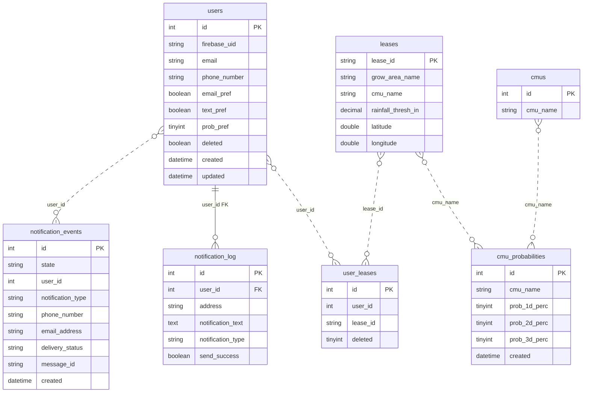
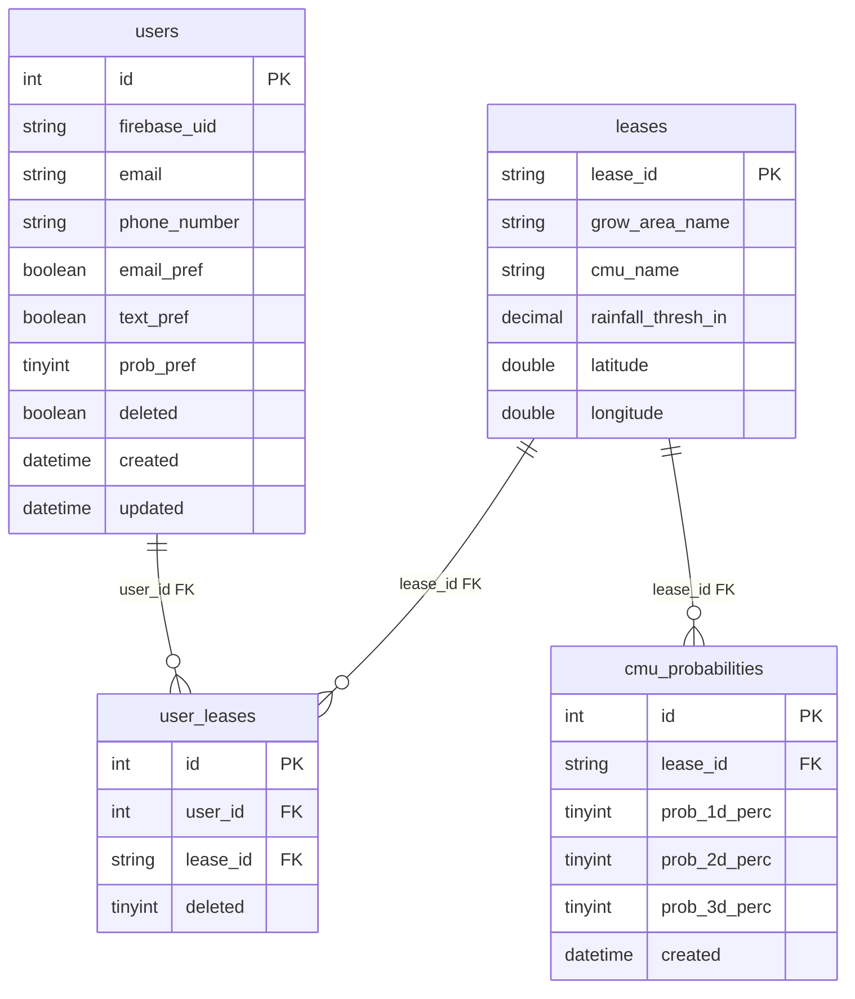
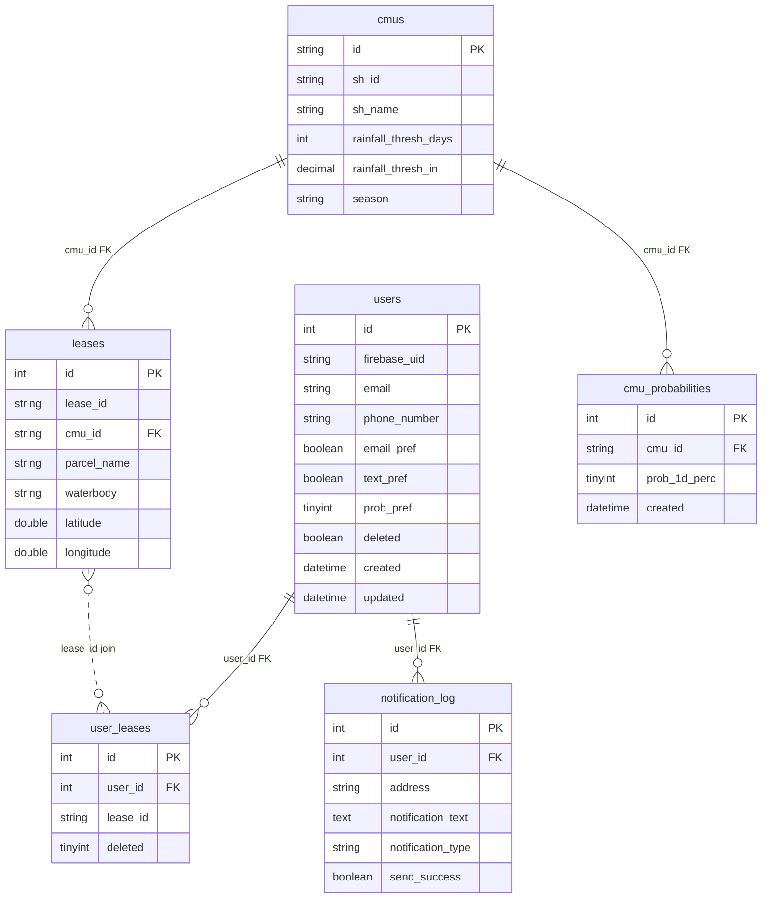

# DATABASE.md

This document is intended to help a developer understand the ShellCast database structure and make changes to the database.

## Table of Contents

1. [Database Design](#1-database-design)
2. [Stored procedures (used vs unused)](DATABASE_STORED_PROCEDURES.md)
3. [Create a Dedicated Database User for Google App Engine]()
4. [Connecting to Google Cloud SQL](#2-connecting-to-google-cloud-sql)
5. [Downloading Database Tables](#3-downloading-database-tables)
6. [Editing User Information and Leases](#4-editing-user-information-and-leases)
7. [Contact Information](#5-contact-information)

## 1. Database Design

ShellCast uses a MySQL 8.0 instance hosted on Google Cloud SQL.

Database table descriptions as below. Each state has a slightly different set of table columns. The database table schema can be found in the `analysis/shellcast-analysis/db_scripts` directory in the sql files.

**Stored procedures** (what exists in MySQL, what analysis vs web calls, and legacy unused procedures): [DATABASE_STORED_PROCEDURES.md](DATABASE_STORED_PROCEDURES.md).

- users
  - Stores information about users.
  - User accounts and authentication are mainly handled by Firebase. In our database, we simply create a user record when a new user registers through Firebase and store the Firebase UID in the record along with other information.
  - **Delete account in the web app does not remove the database row.** It deletes the Firebase user, clears **PII** (personally identifiable information: email, phone, Firebase UID — see [What is PII?](DATABASE_STORED_PROCEDURES.md#what-is-pii)) on the row, and sets `deleted = true`. The `users.id` record stays for audit/history until a separate purge (see [DATABASE_STORED_PROCEDURES.md](DATABASE_STORED_PROCEDURES.md) — recommended: future cron after a retention period).
  - `created` is set once at first sign-in (registration) and is not changed afterward.
  - `updated` is set whenever profile, contact, or notification preferences change (standard `updated_at` audit pattern).
  - Email opt-in/out is tracked with `email_pref` and `email_opt_in_date` / `email_opt_out_date` (not `email_consent`, removed).
- user_leases
  - Stores the leases that users have added to their accounts.
  - Leases are associated with a particular user. If two users create two of the exact same leases, then they will still be stored as two different records in the database.
- leases
  - Stores all of the leases registered with an organization in each state. These are the leases that users can search for in the application and then add to their accounts.
  - The records in this table are "manually" added and should be updated periodically.
- cmus
  - Stores the conditional management units (CMU) or shellfish harvested area (SHA).
  - Records in this table are manually added and should be updated when any changes occur.
- cmu_probabilities
  - Stores calculated closure probabilities for each CMU.
  - These probabilities are calculated and added to the database on a daily basis. The probability for the CMU that a given lease belongs to is also the probability for that lease.
- notification_log
  - Stores a log of all notifications that are sent to users.
  - Each notification is associated with a user that the notification is sent to as well as the closure probability that triggered the notification.

There are 3 "databases" in the Cloud SQL MySQL instance: `shellcast_fl`, `shellcast_nc`, and `shellcast_sc` production database that the live, public site uses. `shellcast_dev` is the development database that is used when running the application on a local machine. `shellcast_testing` is a database that is used for running the unit tests for the application. `shellcast_testing` is wiped clean after every test. </br></br>
Alternatively, you can use locally installed MySQL or a Docker MySQL image for ShellCast analysis development. Modify the `analysis_settings.ini` database connection variable and the database name in `[state]_main.py` to use the new database connection.

Canonical DDL: `analysis/shellcast-analysis/db_scripts/shellcast_create_db_{nc,sc,fl}.sql`.

Entity-relationship diagrams below use [Mermaid](https://mermaid.js.org/syntax/entityRelationshipDiagram.html) (renders on GitHub). Solid lines are foreign keys declared in SQL; dotted lines are joins used by the app or stored procedures but not enforced as FKs.

### North Carolina — `shellcast_nc`

NC stores closure probabilities **per CMU** (`cmu_probabilities.cmu_name`). Leases carry `cmu_name`; daily analysis joins lease → CMU probability. SMS delivery events for **all states** are logged in NC’s `notification_events` table.


```mermaid
erDiagram
    users }o..o{ user_leases : "user_id"
    leases }o..o{ user_leases : "lease_id"
    users ||--o{ notification_log : "user_id FK"
    users }o..o{ notification_events : "user_id"
    leases }o..o{ cmu_probabilities : "cmu_name"
    cmus }o..o{ cmu_probabilities : "cmu_name"

    users {
        int id PK
        string firebase_uid
        string email
        string phone_number
        boolean email_pref
        boolean text_pref
        tinyint prob_pref
        boolean deleted
        datetime created
        datetime updated
    }

    user_leases {
        int id PK
        int user_id
        string lease_id
        tinyint deleted
    }

    leases {
        string lease_id PK
        string grow_area_name
        string cmu_name
        decimal rainfall_thresh_in
        double latitude
        double longitude
    }

    cmus {
        int id PK
        string cmu_name
    }

    cmu_probabilities {
        int id PK
        string cmu_name
        tinyint prob_1d_perc
        tinyint prob_2d_perc
        tinyint prob_3d_perc
        datetime created
    }

    notification_log {
        int id PK
        int user_id FK
        string address
        text notification_text
        string notification_type
        boolean send_success
    }

    notification_events {
        int id PK
        string state
        int user_id
        string notification_type
        string phone_number
        string email_address
        string delivery_status
        string message_id
        datetime created
    }
```

### South Carolina — `shellcast_sc`

SC stores closure probabilities **per lease** (`cmu_probabilities.lease_id`). There is no `cmus` or `notification_log` table in the create script; SMS events are logged to **NC** `notification_events` via the orchestrator API.


```mermaid
erDiagram
    users ||--o{ user_leases : "user_id FK"
    leases ||--o{ user_leases : "lease_id FK"
    leases ||--o{ cmu_probabilities : "lease_id FK"

    users {
        int id PK
        string firebase_uid
        string email
        string phone_number
        boolean email_pref
        boolean text_pref
        tinyint prob_pref
        boolean deleted
        datetime created
        datetime updated
    }

    user_leases {
        int id PK
        int user_id FK
        string lease_id FK
        tinyint deleted
    }

    leases {
        string lease_id PK
        string grow_area_name
        string cmu_name
        decimal rainfall_thresh_in
        double latitude
        double longitude
    }

    cmu_probabilities {
        int id PK
        string lease_id FK
        tinyint prob_1d_perc
        tinyint prob_2d_perc
        tinyint prob_3d_perc
        datetime created
    }
```

### Florida — `shellcast_fl`

FL uses a rich **`cmus`** table (FDACS harvest areas, rainfall rules, seasons). Leases reference `cmus.id`; daily probabilities are **per CMU** with **today only** (`prob_1d_perc`). Forecast email uses `notification_log`; SMS events go to NC `notification_events` like SC.


```mermaid
erDiagram
    users ||--o{ user_leases : "user_id FK"
    users ||--o{ notification_log : "user_id FK"
    cmus ||--o{ leases : "cmu_id FK"
    cmus ||--o{ cmu_probabilities : "cmu_id FK"
    leases }o..o{ user_leases : "lease_id join"

    users {
        int id PK
        string firebase_uid
        string email
        string phone_number
        boolean email_pref
        boolean text_pref
        tinyint prob_pref
        boolean deleted
        datetime created
        datetime updated
    }

    user_leases {
        int id PK
        int user_id FK
        string lease_id
        tinyint deleted
    }

    cmus {
        string id PK
        string sh_id
        string sh_name
        int rainfall_thresh_days
        decimal rainfall_thresh_in
        string season
    }

    leases {
        int id PK
        string lease_id
        string cmu_id FK
        string parcel_name
        string waterbody
        double latitude
        double longitude
    }

    cmu_probabilities {
        int id PK
        string cmu_id FK
        tinyint prob_1d_perc
        datetime created
    }

    notification_log {
        int id PK
        int user_id FK
        string address
        text notification_text
        string notification_type
        boolean send_success
    }
```

### Cross-state comparison

| | NC | SC | FL |
|--|----|----|-----|
| **Probability grain** | CMU (`cmu_name`) | Lease (`lease_id`) | CMU (`cmu_id`) |
| **Forecast days in DB** | 3 (`prob_1d` … `prob_3d`) | 3 | 1 (`prob_1d` only) |
| **`cmus` table** | Minimal name list | — | Full FDACS metadata |
| **`notification_log`** | Yes (analysis email) | Commented out in DDL | Yes (analysis email) |
| **`notification_events` (SMS)** | Yes (all states log here) | Via NC API | Via NC API |

## 2. Create a Dedicated Database User for Google App Engine

1. Generate password </br>
   _Example:_

```
python -c "import secrets; print(secrets.token_urlsafe(16))"
```

2. Connect to your Cloud SQL instance

```
gcloud sql connect {SQL instance name} --user root
```

3. Enter "root" user password after you see folowing.

```
Connecting to database with SQL user [root].Enter password:
```

4. Create user

```sql
-- Create a minimal privilege database user for shellcast-sc application
-- This user will have ONLY the privileges needed for the application to function

-- Create the user (replace 'your_secure_password' with a strong password)
CREATE USER '<user name>'@'%' IDENTIFIED BY '<user password>';

-- Grant only the essential privileges for application operation
-- SELECT: Read data
-- INSERT: Add new records
-- UPDATE: Modify existing records
-- DELETE: Remove records
GRANT SELECT, INSERT, UPDATE ON <database name>.* TO '<user name'@'%';

-- Apply the changes
FLUSH PRIVILEGES;

-- Verify the user was created correctly
SELECT User, Host FROM mysql.user WHERE User = '<user name>';

-- Show the granted privileges
SHOW GRANTS FOR '<user name>'@'%';
```

5. Update "DB_USER" and "DB_PASSWORD" for app.yaml and .env

## 3. Connecting to Google Cloud SQL with MySQL Workbench

1. Install, and initialize the Google Cloud SDK by following [these instructions](https://cloud.google.com/sdk/docs/quickstart).

2. Install MySQL by following [these instructions](https://downloads.mysql.com/archives/community/).
3. Install MySQL Workbench - [MySQL Community Downloads](https://dev.mysql.com/downloads/workbench/).
4. Download the cloud SQL proxy if you haven't already done so. Regardless of where you download it, you can connect to your cloud SQL database from there, but we recommend downloading it under the root of your project for convenience. Cloud SQ Proxy can be downloaded from below links along with instructions.
   - https://github.com/GoogleCloudPlatform/cloud-sql-proxy
   - https://cloud.google.com/sql/docs/mysql/sql-proxy
5. Make TCP connection `./cloud-sql-proxy --port 3306 "{instance_connection_name}"`. You can obtain "instance connection name" from the Google Cloud Console. Go to [View instance information](https://console.cloud.google.com/sql/instances) and click "Instance ID". Copy "Connection name" under "Connect to this instance" section and Rreplace "{instance_connection_name}".
6. Connect to the database instance with MySQL Workbench
   - Now you can connect to the database instance with the following connection details:
     - Host: 127.0.0.1
     - Username: (you should get the password from the maintainers of ShellCast if you're working on ShellCast)
     - Password: (you should get the password from the maintainers of ShellCast if you're working on ShellCast)
     - Port: 3306
7. You can close MySQL Workbench connection by closing DB connection tab.
8. `Ctrl+C` to close the Cloud SQL Proxy connection.

## 4. Downloading Database Tables

3.1 Using MySQL Workbench

1. Download MySQL Workbench from [here](https://dev.mysql.com/downloads/workbench/)
2. Use Cloud SQL Proxy to connect to the database
3. See [Creating A New MySQL Connection](https://dev.mysql.com/doc/workbench/en/wb-getting-started-tutorial-create-connection.html)
4. You can download the current state of the database as CSV files using MySQL Workbench Sequel Pro or .</br>

### 3.2 Using MySQL Client

1. See [Connect using a MySQL client](https://cloud.google.com/sql/docs/mysql/connect-admin-ip#install-mysql-client)
2. In terminal, type in SQL query to download the table as a CSV file. For example, to download the `cmu_probabilities` table in the `shellcast_nc` database, you can use the following query:

```sql
   SELECT * FROM shellcast_nc.cmu_probabilities INTO OUTFILE '/path/to/directory/nc_cmu_probabilities.csv' FIELDS TERMINATED BY ',' ENCLOSED BY '"' LINES TERMINATED BY '\n';
```

## 5. Editing User Information and Leases

- User information such as phone number, email address, and email/text/probability preference can be found in the users table. Simply double-click on the value you would like to change.
- User lease information such as growing area name, CMU name, rainfall threshold, and location can be found in the user_leases table. Simply double-click on the value you would like to change.

## 5. Contact Information

If you have any questions, feedback, or suggestions please submit [GitHub issues](https://github.com/Biosystems-Analytics-Lab/shellcast/issues). You can also reach out to Sheila Saia (ssaia at ncsu dot edu) or Natalie Nelson (nnelson4 at ncsu dot edu).
