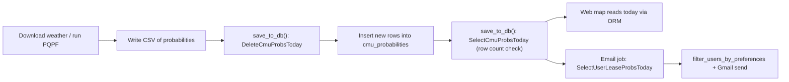

# Stored procedures and database usage

This document lists **MySQL stored procedures** defined in ShellCast schema scripts, which application code calls them, and which exist only for manual or legacy use.

**Canonical SQL sources**

| State | Full schema + procedures |
|-------|---------------------------|
| NC | `analysis/shellcast-analysis/db_scripts/shellcast_create_db_nc.sql` |
| FL | `analysis/shellcast-analysis/db_scripts/shellcast_create_db_fl.sql` |
| SC | `analysis/shellcast-analysis/db_scripts/shellcast_create_db_sc.sql` |

**Web apps (NC, FL, SC)** do **not** call stored procedures. They use SQLAlchemy ORM (`User`, `Lease`, `CMUProbability`, etc.) in `web/shellcast-web-*/routes/`.

---

## What is a stored procedure?

A **stored procedure** is a named block of SQL saved **inside the MySQL database** (not in the Python repo). The database server runs it when something executes:

```sql
CALL ProcedureName();
```

Think of it as a **reusable database script** with a name. Application code (or a DBA in MySQL Workbench) triggers it with `CALL`, instead of sending the full `SELECT` / `DELETE` text every time.

**Why ShellCast uses a few procedures instead of only Python/SQLAlchemy:**

1. **Daily forecast load** — The delete-then-insert pattern for `cmu_probabilities` is fixed and must run exactly the same in NC, FL, and SC. Keeping it in the DB avoids copying fragile SQL into three Python code paths.
2. **Morning email job** — Notification email needs a large join (users → their leases → today’s probabilities). The procedure is the single definition of that join per state; Python only calls `CALL SelectUserLeaseProbsToday()` and filters the rows.
3. **Operations** — A DBA can re-run or inspect the same logic in Workbench without deploying app code.

Procedures are **not** required for features the web app handles (sign-in, preferences, SMS cron). Those use the ORM because they are row-by-row CRUD, not bulk daily batch SQL.

**Two ways to run the same procedure**

| How | Who typically does it |
|-----|------------------------|
| **SQL client** — you type `CALL ...` in MySQL Workbench, `mysql` CLI, or Cloud SQL | Developers, DBAs, support (debugging, manual fixes, inspection) |
| **Python** — analysis code runs `CALL ...` via SQLAlchemy | Automated daily jobs on the analysis server only |

The database executes the **same** stored logic either way. Web apps do **not** use the Python `CALL` path for any procedure in this repo.

---

## Running procedures in SQL

Connect to the correct database first (`shellcast_nc`, `shellcast_fl`, or `shellcast_sc`). See [DATABASE.md](DATABASE.md) for Cloud SQL Proxy / Workbench setup.

### Basic syntax

**No parameters:**

```sql
USE shellcast_nc;

CALL DeleteCmuProbsToday();
CALL SelectCmuProbsToday();
CALL SelectUserLeaseProbsToday();
```

**With parameters** (only where the procedure defines them):

```sql
USE shellcast_nc;

CALL DeleteUserByEmail('grower@example.com');
```

### Inspect results

- `SelectCmuProbsToday` and `SelectUserLeaseProbsToday` return **result sets** (like a `SELECT`). Workbench shows them in a grid; CLI prints rows.
- `DeleteCmuProbsToday` and `DeleteUserByEmail` return **no rows** — check **affected row count** in the client (e.g. “X rows affected”).

### Example: check today’s forecast before/after a test run

```sql
USE shellcast_nc;

-- How many probability rows exist for today?
CALL SelectCmuProbsToday();

-- Optional: clear today only (same as analysis does before re-insert)
-- CALL DeleteCmuProbsToday();

-- Re-run analysis save from Python, or insert test data manually, then:
CALL SelectCmuProbsToday();
```

### Example: see who would be in scope for forecast emails

```sql
USE shellcast_nc;

CALL SelectUserLeaseProbsToday();
```

This does **not** send email; it only returns the joined rows (users with leases and today’s probabilities). Use it to debug “why did no one get an email?” without running the Gmail job.

### Example: list procedures that exist in the database

```sql
SHOW PROCEDURE STATUS WHERE Db = 'shellcast_nc';
```

### Caution

- Run `DeleteCmuProbsToday` only when you intend to **remove today’s forecast** (usually before reloading today’s data).
- Run `DeleteUserByEmail` only on copies or after confirming policy — it **permanently** removes data (unlike the web app’s soft-delete).

---

## Which code uses which procedures (and which tables)

### Master map

| Procedure | **Analysis** Python | **Web** (NC / FL / SC) | Tables read or written |
|-----------|---------------------|-------------------------|-------------------------|
| `DeleteCmuProbsToday` | **Yes** — `utils.save_to_db()` | **No** | **Writes:** deletes from `cmu_probabilities` (today only) |
| `SelectCmuProbsToday` | **Yes** — `utils.save_to_db()` | **No** | **Reads:** `cmu_probabilities` (today only) |
| `SelectUserLeaseProbsToday` | **Yes** — `notifications.py` → `execute_stored_procedure()` | **No** | **Reads:** `users`, `user_leases`, `leases`, `cmu_probabilities` (today, non-deleted) |
| `DeleteUserByEmail` | **No** | **No** | **Writes:** `user_leases`, `notification_log`, `users` (by email) — SQL/manual only (NC create script) |

### Analysis server — file and table detail

| Procedure | Python entry point | Config | Tables |
|-----------|-------------------|--------|--------|
| `DeleteCmuProbsToday` | `analysis/shellcast-analysis/src/utils.py` → `save_to_db()` | `[SaveToDB]` / daily PQPF save flags in `analysis_settings.ini` | `cmu_probabilities` |
| `SelectCmuProbsToday` | Same `save_to_db()` | Same | `cmu_probabilities` |
| `SelectUserLeaseProbsToday` | `analysis/shellcast-analysis/src/notifications.py` → `EmailNotification.send()` | `[Notification] DB_STORED_PROCEDURE` in `analysis_settings.ini` | `users`, `user_leases`, `leases`, `cmu_probabilities` |

Called from state drivers after forecast CSV is produced, for example:

- NC: `analysis/shellcast-analysis/src/nc_pqpf/nc_pqpf.py`
- SC: `analysis/shellcast-analysis/src/sc_pqpf/sc_pqpf.py`
- FL: `analysis/shellcast-analysis/src/fl_pqpf/fl_pqpf.py`

### Web apps — no procedures; ORM tables instead

| Feature | App path | Mechanism | Main tables (not via procedure) |
|---------|----------|-----------|----------------------------------|
| Sign-in / registration | `web/shellcast-web-*/routes/authentication.py` | SQLAlchemy | `users` |
| Preferences, email/phone | `web/shellcast-web-*/routes/api.py` → `POST /user-info` | SQLAlchemy | `users` |
| Phone verify SMS | `POST /verify-phone/send` | SQLAlchemy | `users`; logs via NC `notification_events` |
| Map, leases, search | `routes/api.py` | SQLAlchemy | `leases`, `user_leases`, `cmu_probabilities`, `cmus` (NC) |
| SMS closure cron | `web/shellcast-web-*/routes/cron.py` | SQLAlchemy | `users`, `user_leases`, `leases`, `cmu_probabilities` |
| Account delete | `GET /delete-account` | SQLAlchemy **soft-delete only** — see [Web account deletion](#web-account-deletion-soft-delete-not-row-removal) | `users` row **kept** (`deleted = 1`, PII cleared); Firebase user removed |
| Email unsubscribe link | `routes/pages.py` | SQLAlchemy | `users` |
| SMS STOP / START | `web/shellcast-web-*/core/notifications/inbound.py` | SQLAlchemy | `users` |

So: **all three procedures used in code are analysis-only.** The **web** reads the same tables (`cmu_probabilities`, `users`, etc.) but with normal ORM queries, not `CALL`.

---

## What is PII?

**PII** means **personally identifiable information** — data that can identify a specific person, either on its own or together with other records.

In ShellCast documentation and the delete-account flow, PII usually means fields on `users` that tie a database row to a real person, for example:

| Field | Why it is PII |
|-------|----------------|
| `email` | Direct contact identifier |
| `phone_number` | Direct contact identifier |
| `firebase_uid` | Links the row to a Firebase login identity |

**Not typically treated as PII in this context:** anonymous internal keys (`users.id`), preference flags (`email_pref`, `prob_pref`), opt-in/out **dates**, or `deleted = true` — those describe account state, not who someone is, though `id` can still link rows in a database.

**“Clears PII” on delete account** means the web app sets those contact/login fields to `NULL` (and removes the Firebase user) so the person can no longer be reached or sign in again, while keeping the numeric `users.id` row for history until a later hard purge.

---

## Web account deletion (soft delete, not row removal)

When a grower uses **Delete account** in the NC / FL / SC web app (`GET /delete-account` in `routes/api.py`), the system does **not** remove the row from the `users` table.

**What the web app does:**

1. Deletes the account in **Firebase** (user can no longer sign in).
2. Clears PII on the MySQL row: `firebase_uid`, `email`, `phone_number`, and resets notification preferences.
3. Sets **`users.deleted = true`** and updates `users.updated`.

The **`users.id` row remains** in the database (and may still be referenced by old `notification_log` rows or soft-deleted `user_leases`). Cron jobs and queries that target active users should filter `users.deleted = false` / `0`.

**What the web app does not do:**

- `DELETE FROM users` — no hard delete
- `CALL DeleteUserByEmail` — manual hard-delete by email (NC only); not used by the web delete button

**Lease rows:** Removing a lease from the UI sets `user_leases.deleted = 1`; that also keeps the row until a future purge job removes it.

### Recommended approach for data cleaning

For **production data hygiene**, prefer a scheduled **cron job** (App Engine cron or analysis maintenance) over ad hoc SQL.

| Task | Suggested mechanism | In repo today |
|------|---------------------|---------------|
| Purge accounts soft-deleted longer than retention policy | **Cron** (e.g. monthly) with `DELETE` / new procedures in `shellcast_create_db_*.sql` | **Not implemented** — add when building cron |
| Purge old soft-deleted lease links | **Cron** (optional) | **Not implemented** |
| One-off erasure by email (legal/support) | Manual `CALL DeleteUserByEmail(...)` (NC) | **Yes** — in `shellcast_create_db_nc.sql` |

**Why cron instead of only manual SQL:**

- Same retention rules every run (e.g. “`deleted = 1` and `updated` older than 90 days”).
- Audit/logging can be added in the job (row counts before purge).
- Avoids operators forgetting cleanup or running destructive SQL on the wrong database.

**Not implemented today:** No purge cron exists. Soft-deleted `users` and `user_leases` rows accumulate until you add a cron or run manual `DELETE` statements. See [web/05-development/TODOs.md](web/05-development/TODOs.md).

Example cron design (future):

```text
App Engine cron (per state DB) → COUNT(*) users WHERE deleted = 1 AND updated < retention_cutoff
  → DELETE child rows (user_leases, notification_log) then users (or CALL new purge procedures)
  → log rows removed
```

---

## Summary

| Procedure | In NC / FL / SC create scripts | Called from code? | One-line role |
|-----------|-------------------------------|------------------|---------------|
| `DeleteCmuProbsToday` | All three | **Yes** — analysis | Remove **today’s** forecast rows so a re-run does not duplicate them |
| `SelectCmuProbsToday` | All three | **Yes** — analysis | Read back **today’s** rows to confirm the save worked |
| `SelectUserLeaseProbsToday` | All three | **Yes** — analysis | Build the recipient list for **forecast emails** (user + lease + today’s prob) |
| `DeleteUserByEmail` | **NC only** | **No** | Manual hard-delete by email (SQL only) |

---

## Procedures used in production code

### Background: the `cmu_probabilities` table

Each night/morning the **analysis server** (not the website) downloads weather data, computes shellfish closure **probabilities**, and writes one row per growing unit (CMU) or lease (SC) into `cmu_probabilities`. Each row has a `created` timestamp.

The **public map** and **notification jobs** only care about **today’s** forecast. They effectively ask: “rows where `DATE(created) = today`.” Historical rows from previous days remain in the table for audit or troubleshooting but are not shown as the current forecast.

NC/FL/SC pipelines call `utils.save_to_db()` after writing a CSV (`nc_pqpf`, `sc_pqpf`, `fl_pqpf`).

**Order of operations on a typical day:**



1. Analysis computes probabilities → CSV on disk.
2. `DeleteCmuProbsToday` → remove any **existing** rows stamped **today** (e.g. from an earlier failed or test run).
3. Append CSV → **today’s** snapshot is now in the table.
4. `SelectCmuProbsToday` → confirm row count.
5. Later, email notification calls `SelectUserLeaseProbsToday` → who should get an email and with what lease/prob data.

---

### `DeleteCmuProbsToday`

**SQL behavior:**

```sql
DELETE FROM cmu_probabilities WHERE DATE(created) = CURDATE();
```

(`CURDATE()` is the database server’s current calendar date in its timezone.)

**Purpose — why this step exists**

ShellCast treats **today’s forecast as a single snapshot**, not an append-only log for the same calendar day.

Without this delete, every time the analysis job saves to the database on the **same day**, it would **add another full set of rows** via `pandas.to_sql(..., if_exists="append")`. You could end up with:

- Two or more rows for the same CMU (or lease) all dated “today”
- The map or email logic seeing duplicates or ambiguous “which row is correct?”
- A failed partial run followed by a retry leaving a mix of old and new numbers for today

**“Clears today’s `cmu_probabilities` before daily reload” means:**

1. Before inserting the **new** CSV for this run, delete **only** rows whose `created` date is **today**.
2. Rows from **yesterday and earlier** are **not** deleted — history stays.
3. Insert the fresh CSV so **today** has exactly **one** generation of probabilities.

So it is a **replace-today** operation, not “empty the whole table.”

**When it runs:** Inside `save_to_db()` in `analysis/shellcast-analysis/src/utils.py`, immediately before `to_sql` append, at the end of the daily PQPF pipeline when saving to Cloud SQL is enabled.

**Who depends on it:** Indirectly everything that reads “today’s” probs — the web map (ORM query for latest/today’s data) and `SelectUserLeaseProbsToday` for emails. They assume at most one logical forecast per CMU/lease per day.

---

### `SelectCmuProbsToday`

**SQL behavior:**

```sql
SELECT * FROM cmu_probabilities WHERE DATE(created) = CURDATE();
```

**Purpose — why this step exists**

After delete + insert, the analysis job needs a **simple integrity check**: “Did the number of rows we just inserted match the number of rows MySQL has for today?”

`save_to_db()` compares:

- `len(df)` from the CSV
- `queryset.rowcount` from `CALL SelectCmuProbsToday()`

If they differ, something went wrong (partial insert, wrong database, empty delete, etc.) and the pipeline should not silently assume success.

It is **not** used to drive the website map or emails directly in Python; those use their own queries. Here it is a **post-save verification** step tied to the daily reload workflow.

**When it runs:** Right after append in `save_to_db()`, same transaction block as the delete and insert.

---

### `SelectUserLeaseProbsToday`

**Purpose — why this procedure exists**

After today’s probabilities are in the database, the **analysis server** sends **forecast emails** to growers who opted in. For each email it must know, in one place:

- Who the user is (`email`, `email_pref`, `prob_pref`, …)
- Which leases they follow
- What **today’s** closure probabilities are for those leases (1-day / 2-day / 3-day depending on state)

That requires joining four tables:

`users` → `user_leases` → `leases` → `cmu_probabilities` (today’s rows only, non-deleted users and leases).

The procedure encodes that join **once per state** (NC joins on `cmu_name`, SC on `lease_id`, FL on `cmu_id` — see table below). Python calls:

```python
execute_stored_procedure(connect_str, "SelectUserLeaseProbsToday")
```

then filters rows in `filter_users_by_preferences()` (probability threshold, email opt-in, etc.). See [06-NOTIFICATIONS_ANALYSIS.md](analysis/06-NOTIFICATIONS_ANALYSIS.md).

**Why not only ORM in Python?** The web app could duplicate this with SQLAlchemy, but the email job runs on the **analysis** machine with a thin `CALL` + config `DB_STORED_PROCEDURE`. The procedure keeps notification SQL aligned with what DBAs expect in the schema scripts.

**Important:** **SMS text alerts** are **not** sent through this procedure. They are sent from the **web** App Engine cron using ORM queries. This procedure is for the **Gmail / analysis email** path only.

**Configured as:** `[Notification] DB_STORED_PROCEDURE` in `analysis_settings.ini` (usually `SelectUserLeaseProbsToday`).

**When it runs:** During `EmailNotification.send()` in `analysis/shellcast-analysis/src/notifications.py`, after the daily forecast has been saved and notifications are enabled for that state.

**Defined in:** all three `shellcast_create_db_*.sql` files (join logic differs by state).

**Columns returned (conceptual):**

| Column | Used by notification code |
|--------|---------------------------|
| `user_id`, `email`, `phone_number` | Yes (email path uses `email`; SMS is sent from **web** cron, not this procedure) |
| `email_pref`, `text_pref`, `text_consent`, `prob_pref` | Yes (`email_pref`, `prob_pref`; text fields present but email job filters on email) |
| `prob_1d_perc` | Yes (all states) |
| `prob_2d_perc`, `prob_3d_perc` | Yes for NC and SC; **not selected in FL** procedure (FL uses 1-day-only filter in Python) |
| Lease identifiers (`lease_id`, `grow_area_name`, `cmu_name`, FL parcel fields, etc.) | Yes — email body content |

**Not returned by procedure (tracked elsewhere):**

- `email_opt_in_date`, `email_opt_out_date`, `text_opt_in_date`, `text_opt_out_date` — set by **web** preferences / unsubscribe / SMS STOP|START; not part of this query
- `email_verified`, `email_verified_at` — columns exist; verification not implemented (see [web/05-development/TODOs.md](web/05-development/TODOs.md))
- `users.created`, `users.updated` — web registration / profile timestamps only

**State-specific join differences (important when editing the procedure):**

| State | Probabilities joined on | Forecast columns in SELECT |
|-------|-------------------------|----------------------------|
| NC | `leases.cmu_name` = `cmu_probabilities.cmu_name` | `prob_1d_perc`, `prob_2d_perc`, `prob_3d_perc` |
| SC | `leases.lease_id` = `cmu_probabilities.lease_id` | `prob_1d_perc`, `prob_2d_perc`, `prob_3d_perc` |
| FL | `leases.cmu_id` = `cmu_probabilities.cmu_id` | `prob_1d_perc` only |

All variants filter: today’s `cmu_probabilities`, `users.deleted = false`, `user_leases.deleted = 0`.

---

## Procedures not used by code (still valid in SQL)

These are **installed in the database** (or in schema scripts) but **no** analysis or web Python calls them. You can still run them with `CALL` in Workbench or the `mysql` CLI—for operations, compliance, or debugging.

### `DeleteUserByEmail` (NC create script only)

**Purpose:** One-shot **hard delete** of a user and related rows by email (`user_leases`, `notification_log`, `users`).

**SQL:**

```sql
USE shellcast_nc;
CALL DeleteUserByEmail('grower@example.com');
```

**When to use (examples):**

- **GDPR / right-to-erasure** on a dev or staging copy after backup, when policy requires removing PII from MySQL entirely (not just soft-delete).
- **Cleaning a bad test account** that should never have existed in a non-production database.
- **Support mistake** — duplicate account created with wrong email and must be removed from DB tables manually.

**When not to use:**

- Normal grower “delete my account” in production — the **web** only soft-deletes (see [Web account deletion](#web-account-deletion-soft-delete-not-row-removal)); use a **future purge cron** after retention if hard removal is required.
- FL/SC databases — procedure exists in **NC** `shellcast_create_db_nc.sql` only, not in FL/SC create scripts.

---

### Manual use of “analysis” procedures (optional)

Even though analysis Python already calls them, operators sometimes run the same `CALL` in SQL:

| Procedure | Example when to run manually in SQL |
|-----------|-------------------------------------|
| `DeleteCmuProbsToday` | Fix duplicate today rows after a bad test without re-running full PQPF |
| `SelectCmuProbsToday` | Verify today’s row count matches expectation before enabling notifications |
| `SelectUserLeaseProbsToday` | Debug email recipient list without sending Gmail |

---


## Configuration that looks like procedures but is unused

| Setting | Location | Status |
|---------|----------|--------|
| `[Notification] DB_STORED_PROCEDURE` | `analysis_settings.ini` | **Used** — name passed to `execute_stored_procedure()` |
| `[CMU.Developer] STORED_PROCEDURE` | Referenced in `management.py` as `cmu_stored_procedure` | **Unused** — property exists; no caller in the repo. CMU daily load uses hard-coded `DeleteCmuProbsToday` / `SelectCmuProbsToday` in `save_to_db()` |

---

## Feature checklist (procedure vs ORM)

Quick reference aligned with the master map above:

| Capability | Runs on | Stored procedure? | Tables (typical) |
|------------|---------|---------------------|------------------|
| Daily probability load | **Analysis** | **Yes** — `DeleteCmuProbsToday`, `SelectCmuProbsToday` | `cmu_probabilities` |
| Daily forecast emails | **Analysis** | **Yes** — `SelectUserLeaseProbsToday` | `users`, `user_leases`, `leases`, `cmu_probabilities` |
| User registration | **Web** | No — ORM | `users` |
| Preferences / contact | **Web** | No — ORM | `users` |
| Phone verification SMS | **Web** | No — ORM | `users`, `notification_events` (NC) |
| SMS closure alerts | **Web** cron | No — ORM | `users`, `user_leases`, `leases`, `cmu_probabilities` |
| Map / lease APIs | **Web** | No — ORM | `leases`, `user_leases`, `cmu_probabilities`, … |
| Account delete (in app) | **Web** | No procedure — sets `users.deleted = 1`, clears PII; **row not removed** | `users` (row retained) |
| Hard delete by email | **SQL only** (NC) | `DeleteUserByEmail` | `users`, `user_leases`, `notification_log` |
| Purge soft-deleted users / leases | **Future cron** (not in db_scripts yet) | No procedure in repo — implement `DELETE` or add procedures to create scripts | `users`, `user_leases`, `notification_log` |
| Email send history | **Analysis** | No — direct insert | `notification_log` |

---

## Related database objects (not procedures)

| Object | In scripts | Used in code |
|--------|------------|--------------|
| `shellcast_unified.all_users` (VIEW) | `create_unified_users_view.sql` | Reporting / analytics only; not called by web or analysis Python |
| `notification_log` | NC, FL create scripts; commented out in SC create | **Analysis** appends after email sends; **not** used by web |
| `notification_events` | NC create script | **Web** (NC SMS logging); FL/SC POST to NC log API |
| `phone_service_providers` | Documented historically | **Removed** — never had a create script or code |

---

## Changing or redeploying procedures

1. Edit the procedure in the correct `shellcast_create_db_{nc,fl,sc}.sql` (keep the three states consistent in *behavior*, not necessarily identical SQL).
2. On Cloud SQL, run:
   ```sql
   USE shellcast_nc;   -- or shellcast_fl / shellcast_sc
   DROP PROCEDURE IF EXISTS SelectUserLeaseProbsToday;
   -- paste updated CREATE PROCEDURE ... from the script
   ```
3. If you changed `users` columns on live databases (e.g. dropped legacy `email_consent`), run the matching `ALTER TABLE` on each state DB and recreate `shellcast_unified.all_users` from `create_unified_users_view.sql` if used.
4. Run analysis notification tests / a dry-run email job in dev to confirm `filter_users_by_preferences()` still receives expected keys.

See also [DATABASE.md](DATABASE.md) (tables and columns), [analysis/07-DEVELOPMENT.md](analysis/07-DEVELOPMENT.md), and [analysis/02-CONFIGURATION.md](analysis/02-CONFIGURATION.md) (`DB_STORED_PROCEDURE`).
