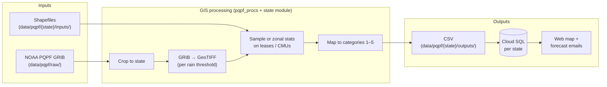
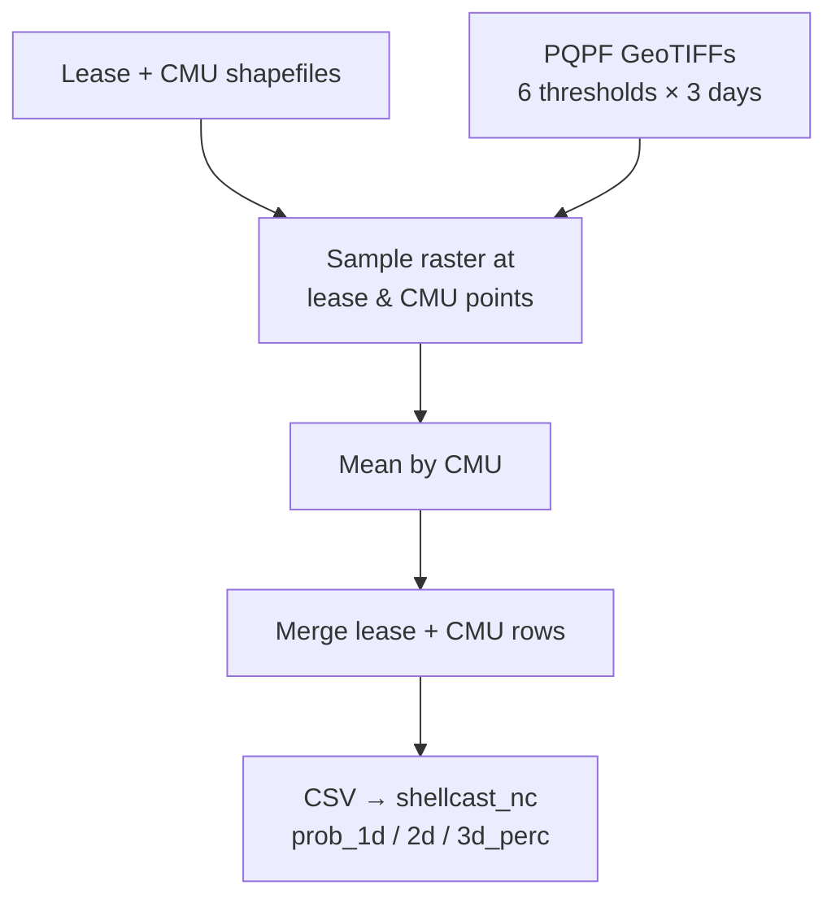
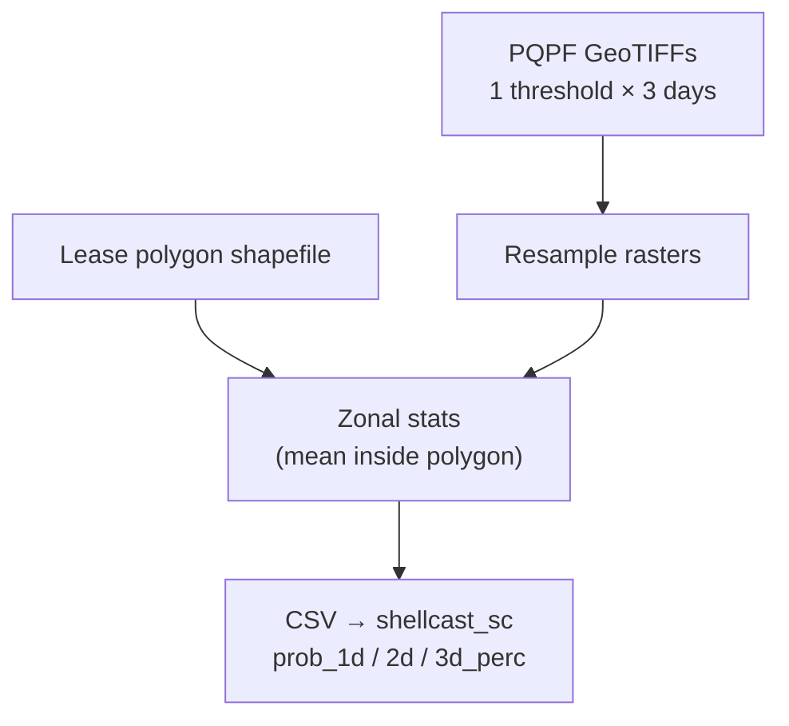
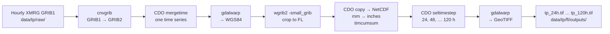
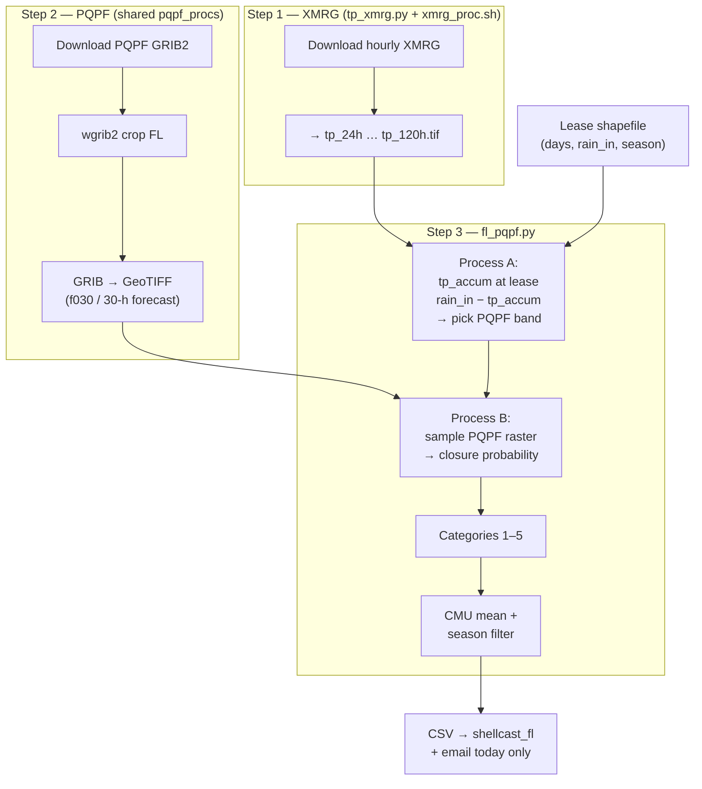

# 3. State guides (NC, SC, FL)

> **Doc 3 of 9** · [← 2. Configuration](02-CONFIGURATION.md) · [Index](README.md) · [Next: 4. Data prep →](04-DATA_PREP_README.md)

Each state has its own Cloud SQL database, shapefile inputs, and Python module under `src/{state}_pqpf/`. All three share `pqpf_procs.py` and `utils.py`.

## GIS analysis — quick overview

ShellCast answers: **“If this much rain falls, what is the chance of a temporary closure at each lease or growing unit?”** NOAA **PQPF** (Probabilistic Quantitative Precipitation Forecast) supplies that chance on a grid. GIS steps **join those grids to leases and CMUs** so the web map, database, and emails show risk where growers actually work.

### Shared PQPF pipeline (all states)

**Why each step**

| Step | Why |
|------|-----|
| Download GRIB | Get today’s official PQPF from NOAA |
| Crop (`wgrib2`) | Keep only the state bounding box — faster and smaller |
| GRIB → GeoTIFF | Turn forecast grids into map layers Python/GIS can sample |
| Overlay shapefiles | Attach probabilities to **leases** and/or **growing units (CMUs)** |
| Categories 1–5 | Same labels everywhere (Very Low → Very High) for map, DB, and alerts |



**Spatial inputs (prepared offline):** lease points/polygons and (where used) CMU boundaries — see [04-DATA_PREP_README.md](04-DATA_PREP_README.md). Analysis does **not** read raw agency downloads directly.

---

### North Carolina — point sampling + CMU mean

**Why:** NC has both **lease points** and **CMU polygons**. Sample PQPF at each lease for 24h / 48h / 72h and multiple rain thresholds; average by CMU for areas without leases.



---

### South Carolina — zonal stats on lease polygons

**Why:** SC uses **lease polygons only** (SHA areas ≈ leases). **Zonal statistics** average each raster inside each polygon — no separate CMU layer.



---

### Florida — observed rain (XMRG) + PQPF + seasons

**Why Florida is different:** FDACS closure rules use **how much rain has already fallen** over a **multi-day window**, not a single fixed inch threshold like NC/SC. ShellCast must (1) build **observed** multi-day totals from NOAA **XMRG**, (2) compare each lease’s rule to that total, (3) read the matching **PQPF** probability for **today’s** forecast, then (4) apply **harvest season** dates on CMUs.

#### The 7-day window (observed + today)

| Concept | Detail |
|---------|--------|
| **Maximum lookback** | Up to **6 days of observed hourly rain** + **today’s PQPF forecast** → **7 calendar “ShellCast days”** of rules on leases |
| **ShellCast “day” anchor** | **7:00 AM Eastern** (`TPXMRG(..., hour_from=7)` in `fl_main.py`) — not midnight. A “day” is the 24 hours ending at that morning anchor (see note in `tp_xmrg.py`). |
| **Hourly source** | **XMRG** — NOAA quality-controlled **1-hour** total precipitation (GRIB1, ~4.7 km, polar stereographic). Files: `xmrg{MMDDYYYYHH}z.grb` |
| **Download** | `tp_xmrg.py` → FTP `tgftp.nws.noaa.gov` … `data/rfc/serfc/misc/` → `data/tp/raw/` (~**144 hourly files** = 6 × 24 h when complete) |
| **Lease attributes** | Each point has **`days`** (1–7) and **`rain_in`** (FDACS rainfall threshold for that duration). Day **1** uses PQPF only (`tp_accum = 0`). Days **2–6** map to `tp_24h` … `tp_120h` (24 h steps). |

#### XMRG processing (`xmrg_proc.sh`) — tools and why

Hourly GRIB1 must become **24-hour cumulative rain maps** in inches at lease locations. The shell script chains standard geospatial CLI tools:



| Tool | Role in this pipeline |
|------|------------------------|
| **`cnvgrib`** (NCEPLIBS-grib_util) | XMRG arrives as **GRIB1**; CDO/GDAL steps expect **GRIB2**. Converts each hourly file. |
| **CDO `mergetime`** | Stack ~144 hourly files into one multi-time grid. |
| **GDAL `gdalwarp`** | Reproject from polar stereographic to **WGS84** (same CRS as lease shapefiles). |
| **wgrib2 `-small_grib`** | Crop CONUS grid to Florida bounds (same idea as PQPF crop in `pqpf_procs.py`). |
| **CDO `expr` / `setattribute`** | Convert 1-h totals **mm → inches**; set units metadata. |
| **CDO `timcumsum`** | XMRG is **rain per hour only**. This **adds hours in order**: at hour 1 → that hour’s rain; at hour 2 → hour 1 + hour 2; at hour 24 → **total over the first 24 hours**; and so on. Each timestep becomes “rain so far since the start of the series,” not rain in a single hour. |
| **CDO `seltimestep,N`** | Pick the grid at hour **N** from that running total (N = 24, 48, 72, 96, 120) → one map per **multi-day total** (e.g. 48 h = sum of 48 consecutive hourly files). |
| **GDAL → GeoTIFF** | Write `tp_24h.tif` … `tp_120h.tif` for Python/rasterio to sample at lease points. |

Install notes: [09-ANALYSIS.md](09-ANALYSIS.md) §4.6–4.8 (`wgrib2`, `cnvgrib`, CDO).

#### From XMRG GeoTIFFs to closure risk (Python)



| Step | What | Why |
|------|------|-----|
| **Process A** | For each lease, read **`tp_{(days−1)×24}h.tif`** (day 1 → no XMRG; use 0). Compute **`rain_in − observed_accum`** → maps to a **PQPF inch threshold** via `fl_qppf_threshold_generator`. | Tells you **which PQPF layer** (0.2", 0.5", 1", … 16") matches the FDACS rule after observed rain. |
| **Process B** | Sample that PQPF GeoTIFF at the lease point. If `rain_in − accum` is already negative, probability = **1** (closure essentially certain). | Turns the correct forecast band into a numeric closure probability. |
| **CMU + season** | Mean lease probs by CMU; drop or neutralize CMUs **outside harvest season** (`get_season_now`). | Map and DB match FDACS seasonal harvest areas. |

#### XMRG vs PQPF — two different data sources

Florida uses **two weather products on the same run day**. They answer different questions:

| | **XMRG** (Step 1) | **PQPF** (Step 2) |
|--|-------------------|-------------------|
| **Question** | How much rain **already fell**? | What is the **forecast chance** more rain will push us over the limit? |
| **Type** | **Observed** hourly rain (past) | **Probabilistic forecast** (today / near future) |
| **Time** | ~6 days of **past** hours (aligned to 7 AM Eastern) | **Today’s** forecast period only (FL emails one day) |
| **Format** | Hourly GRIB1 → `tp_24h.tif` … `tp_120h.tif` | Daily PQPF GRIB2 → probability rasters per inch band |
| **Role in code** | **Process A** — `rain_in − observed` → pick PQPF inch band | **Process B** — read closure **probability** from that band |

**Why both?** FDACS rules look like: “If **this much** rain falls over **N days**, closure risk applies.” XMRG supplies the **N-day observed total** so far. PQPF supplies the **chance today’s forecast adds enough** to hit the rule’s inch threshold.

**Example (simplified):** A lease has a 2-day rule: `rain_in = 3.0 in`, `days = 3`. XMRG `tp_48h` might show **2.1 in already observed**. Process A computes `3.0 − 2.1 = 0.9 in` still “allowed” → maps to a **PQPF layer** near 1 inch. Process B reads that layer’s **probability** at the lease (e.g. 0.65 → Moderate).

#### PQPF side (same morning, after XMRG)

`FLPQPF` uses the same NOAA PQPF download as NC/SC, but Florida **only processes one forecast file**:

| State | PQPF files downloaded | Files cropped & turned into GeoTIFFs |
|-------|----------------------|--------------------------------------|
| NC / SC | `f030`, `f054`, `f078` (≈ today, +1 day, +2 days) | All three → 3-day emails |
| **FL** | Same three may download | **`f030` only** → **today’s** forecast |

**What is `f030`?** After NOAA’s **06Z run (~1 AM Eastern)**, the first full forecast “rain day” ends **30 hours** later at **12Z (~7 AM Eastern in winter)** — that file is **`f030`**. ShellCast treats it as **today’s** 24-hour PQPF window (many inch thresholds as GeoTIFFs). Process B picks **one** raster based on Process A. Full Z-time walkthrough (why **06Z**, then why **30**): [09-ANALYSIS.md §3.1](09-ANALYSIS.md#z-time-why-06z-then-why-f030).

So: **XMRG = backward-looking totals; PQPF = forward-looking probabilities.** They meet in Process A → Process B.

**Season filter:** CMUs outside their open season get a placeholder value (no active harvest risk).

**Code / data paths:** `fl_main.py` → `TPXMRG` then `FLPQPF` · inventory JSON `data/tp/tpxmrg_inventory.json` · deep tool compile notes in [09-ANALYSIS.md](09-ANALYSIS.md).

---

## Comparison

| | North Carolina | South Carolina | Florida |
|--|----------------|----------------|---------|
| **Main** | `nc_main.py` | `sc_main.py` | `fl_main.py` |
| **Module** | `nc_pqpf/nc_pqpf.py` | `sc_pqpf/sc_pqpf.py` | `fl_pqpf/fl_pqpf.py` |
| **Database** | `shellcast_nc` | `shellcast_sc` | `shellcast_fl` |
| **Forecast days in email** | Today + 2 days | Today + 2 days | Today only |
| **CMU + lease** | Yes (points) | Lease polygons only | Yes (season-aware CMU) |
| **Extra weather data** | PQPF only | PQPF only | PQPF + XMRG accumulation (`tp_xmrg.py`) |
| **Spatial inputs** | Local `data/pqpf/nc/inputs/` | Local `data/pqpf/sc/inputs/` | Local `data/pqpf/fl/inputs/` (GCS bucket optional; see [02-CONFIGURATION.md](02-CONFIGURATION.md)) |
| **PQPF thresholds (inches)** | 1.0, 1.5, 2.0, 2.5, 3.0, 4.0 | 4.0 (zonal) | Duration-based via rainfall rules |
| **Web app** | shellcast-web-nc | shellcast-web-sc | shellcast-web-fl |

## North Carolina

**GIS in one line:** sample PQPF at lease/CMU **points** → CMU means → merge → DB.

**Flow (`NCPQPF.main`):**

1. Download today's PQPF GRIBs from NOAA FTP
2. Crop/subset/process GRIB → GeoTIFF
3. Sample probabilities at lease points; mean within CMU
4. Map to categories 1–5 (Very Low → Very High)
5. Write CSV → MySQL if `SAVE_TO_DB`
6. `EmailNotification` — 3-day lease text in body

**Key config (`[NC]`):** `CMU_SHP`, `LEASE_SHP`, column names, `LON_WE`, `LAT_SN`.

## South Carolina

**GIS in one line:** **zonal mean** of PQPF inside each **lease polygon** → DB.

**Flow (`SCPQPF.main`):**

1. PQPF download and TIFF pipeline (shared)
2. **Zonal statistics** on lease polygons (`rasterstats`)
3. Single threshold from `[SC] THRESHOLD`
4. Save to DB; email with 3-day probabilities

**Note:** SHA boundaries are treated as lease areas (no separate CMU layer like NC).

## Florida

**GIS in one line:** Hourly **XMRG** → multi-day accumulation rasters → subtract from FDACS **`rain_in`** rules → sample matching **PQPF** → CMU mean + **season** → DB (today only in email).

**Two-part daily run (`fl_main.py`):**

1. **`TPXMRG`** — download ~6 days of hourly XMRG; `xmrg_proc.sh` (cnvgrib, CDO, GDAL, wgrib2) → `tp_24h.tif` … `tp_120h.tif`
2. **`FLPQPF.main`** — PQPF download/crop/GeoTIFF; Process A/B on leases; CMU + season CSVs → DB

See **Florida — observed rain (XMRG) + PQPF + seasons** above for flowcharts and tool table.

**Legacy detail:** optional GCS input download, compile paths — [09-ANALYSIS.md](09-ANALYSIS.md) §3.2, §4.6–4.8 · [04-DATA_PREP_README.md](04-DATA_PREP_README.md)

**Key config (`[FL]`):** `LEASE_SHP`, lease `days` / `rain_in` columns, `LON_WE` / `LAT_SN`, season fields.

## Probability categories

All states map numeric model output to categories **1–5** for display and email:

| Value | Label |
|-------|--------|
| 1 | Very Low |
| 2 | Low |
| 3 | Moderate |
| 4 | High |
| 5 | Very High |

User `prob_pref` in the database is a minimum category (1–5). Analysis includes a user when today's (and for NC/SC, tomorrow's or day+2) forecast **meets or exceeds** that preference.

## Code entry points

```text
analysis_run.sh
  → nc_main.py  → DirectoryConfig("NC") → NCPQPF → EmailNotification
  → sc_main.py  → DirectoryConfig("SC") → SCPQPF → EmailNotification
  → fl_main.py  → TPXMRG → FLPQPF → EmailNotification (+ DevEmailNotificationFL)
```

## Related

- [09-ANALYSIS.md](09-ANALYSIS.md) — PQPF and XMRG data specifications
- Input shapefiles — your input-dataset documentation (in progress)
- [06-NOTIFICATIONS_ANALYSIS.md](06-NOTIFICATIONS_ANALYSIS.md)
