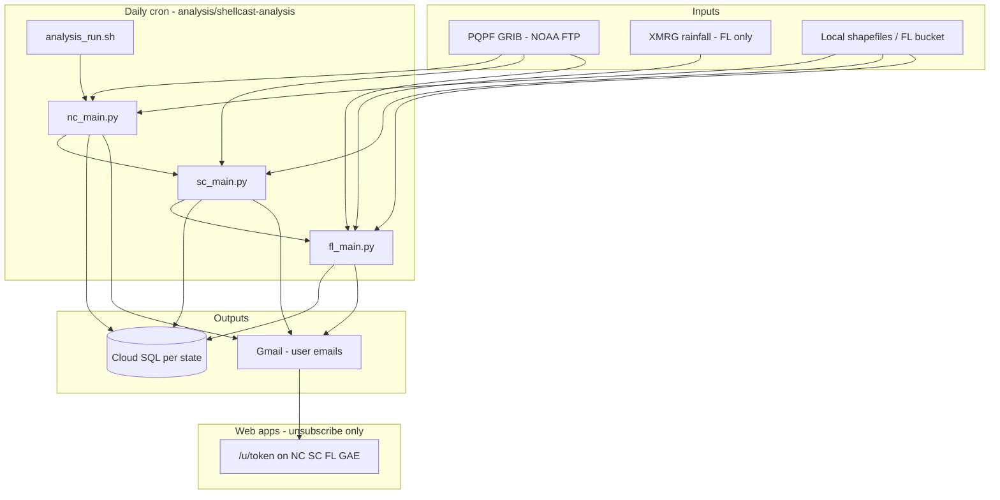

# ShellCast analysis documentation

Documentation for **daily forecast analysis** (`analysis/shellcast-analysis`) and how it connects to the database and web apps.

Files in this folder are **numbered** (`01-` … `09-`) so you can read them in order. **README.md** (this file) is the index and is not numbered.

## Reading order

| # | Document | Purpose |
|---|----------|---------|
| — | **README.md** (this file) | Index, system overview, layout |
| 1 | [01-GETTING_STARTED.md](01-GETTING_STARTED.md) | First successful run on your machine |
| 2 | [02-CONFIGURATION.md](02-CONFIGURATION.md) | `analysis_settings.ini`, `analysis_paths.sh`, secrets |
| 3 | [03-STATE_GUIDES.md](03-STATE_GUIDES.md) | NC vs SC vs FL behavior; **GIS flowcharts** |
| 4 | [04-DATA_PREP_README.md](04-DATA_PREP_README.md) | Spatial input prep overview (all states; FL ArcPy scripts) |
| 5 | [05-DAILY_OPERATIONS.md](05-DAILY_OPERATIONS.md) | Production cron on the analysis iMac |
| 6 | [06-NOTIFICATIONS_ANALYSIS.md](06-NOTIFICATIONS_ANALYSIS.md) | Gmail emails from analysis; web unsubscribe |
| 7 | [07-DEVELOPMENT.md](07-DEVELOPMENT.md) | Changing code and deploying to production |
| 8 | [08-TROUBLESHOOTING.md](08-TROUBLESHOOTING.md) | Common failures |
| 9 | [09-ANALYSIS.md](09-ANALYSIS.md) | Background, PQPF/XMRG specs, GIS processing (Florida XMRG pipeline) |

**Input datasets** (shapefiles, bucket layout, file lists) are documented separately — start with [04-DATA_PREP_README.md](04-DATA_PREP_README.md) and any input-data guide you maintain.

## Who should read what

| Audience | Start here |
|----------|------------|
| New developer / researcher | [01-GETTING_STARTED.md](01-GETTING_STARTED.md) |
| Person running the daily iMac cron | [05-DAILY_OPERATIONS.md](05-DAILY_OPERATIONS.md) |
| Changing code or deploying to production | [07-DEVELOPMENT.md](07-DEVELOPMENT.md) |
| Email alerts from the analysis server | [06-NOTIFICATIONS_ANALYSIS.md](06-NOTIFICATIONS_ANALYSIS.md) |
| `analysis_settings.ini` / `analysis_paths.sh` / secrets | [02-CONFIGURATION.md](02-CONFIGURATION.md) |
| NC vs SC vs FL behavior | [03-STATE_GUIDES.md](03-STATE_GUIDES.md) |
| Something failed | [08-TROUBLESHOOTING.md](08-TROUBLESHOOTING.md) |
| Deep background, PQPF/XMRG specs, GIS processing | [09-ANALYSIS.md](09-ANALYSIS.md) |
| Install wgrib2 (all states) | [01-GETTING_STARTED.md](01-GETTING_STARTED.md) §5 |
| Install Florida tools (wgrib2, CDO, cnvgrib, GDAL) | [01-GETTING_STARTED.md](01-GETTING_STARTED.md) §6 |
| Spatial input prep (all states; FL ArcPy scripts) | [04-DATA_PREP_README.md](04-DATA_PREP_README.md) |

## System overview



**Email is sent from the analysis machine** (Gmail API). **One-click unsubscribe** is handled by each state's web app (`/u/<token>`), not by analysis code.

## Repository layout

```
analysis/
  requirements.txt          # Python deps for shellcast-analysis venv
  shellcast-analysis/
    analysis_run.sh         # Cron entry: proxy + NC + SC + FL
    analysis_settings.template.ini  # Copy to analysis_settings.ini (gitignored)
    analysis_paths.template.sh      # Copy to analysis_paths.sh (gitignored)
    nc_main.py / sc_main.py / fl_main.py
    setup_logging.py
    src/
      pqpf_procs.py         # Shared PQPF steps
      utils.py
      management.py         # DirectoryConfig, NotificationConfig
      notifications.py      # Email send + filtering
      nc_pqpf/ sc_pqpf/ fl_pqpf/
    db_scripts/             # SQL schema reference
    data/                   # gitignored: GRIB, inputs, outputs
```

Logs (sibling of `shellcast-analysis/`): `analysis/logs/{nc,sc,fl}/info.log` and `error.log`.

## Related docs outside this folder

- [DATABASE.md](../DATABASE.md) — Cloud SQL setup and tables
- [web/README.md](../web/README.md) — web apps (`01-` … `07-`); SMS (Bandwidth), unsubscribe
- [GETTING_STARTED.md](../../GETTING_STARTED.md) — Fork or clone, pre-commit, run locally
- [README.md](../../README.md) — Project overview and architecture
