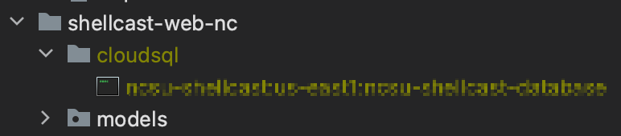

# 7. Web reference (detailed legacy guide)

> **Doc 7 of 7** · [← 6. Troubleshooting](06-TROUBLESHOOTING.md) · [Index](README.md)

Long-form reference carried forward from the original `WEB.md`. For day-to-day work, prefer the numbered guides [01](01-GETTING_STARTED.md)–[06](06-TROUBLESHOOTING.md), [05-DEVELOPMENT.md](05-DEVELOPMENT.md) (and [subsections](05-development/)), and [README.md](README.md).

ShellCast was initially developed for North Carolina and later expanded to South Carolina and Florida. The web application was duplicated for SC and FL and modified accordingly. For scalability, separating APIs from front-end web components may be considered in the future.

Some steps below assume a **Unix** machine (Linux/macOS). Windows may work with TCP database access and adjusted paths; see [01-GETTING_STARTED.md](01-GETTING_STARTED.md).

## Table of Contents

1. [Code Structure](#1-code-structure)

2. [Notable Technologies Used](#2-notable-technologies-used)

3. [General Notes](#3-general-notes)

4. [Development Environment Setup](#4-development-environment-setup)

5. [Common Development Tasks](#5-common-development-tasks)

6. [Testing](#6-testing)

7. [Contact Information](#7-contact-information)

## 1. Code Structure

- main.py - The root of the Python Flask application.
- app.yaml - Configuration for deploying the app to Google Cloud.
- cron.yaml - Configuration for cron jobs running on Google App Engine.
- config-template.py - Template that should be copied to make a local config.py file.
- .gcloudignore - This file is similar to a .gitignore file in the sense that it specifies all of the files that will **not** be uploaded to Google Cloud during deployments.
- .coveragerc - Configuration for the pytest-cov code coverage library.
- requirements.txt - Dependencies for the Python app.
- requirements-test.txt - Dependencies for unit tests.
- **templates** - Contains all of the Jinja templates used to render each page of the site.
- **static** - Contains all of the static content for each web page (CSS, JS, images, etc).
- **models** - Contains all of the Object Relational Mapping (ORM) models that are used to interact with the database.
- **routes** - Contains all of the routes that are registered with the Flask application.
- **tests** - Contains all of the unit tests for the application. _❗This feature is not currently available. This needs to be updated._

## 2. Notable Technologies and Services Used

- [Flask](https://flask.palletsprojects.com/en/1.1.x/) - Flask is a lightweight web app framework written in Python. It is used for all of the backend logic of the web app.
- [SQLAlchemy](https://www.sqlalchemy.org/) - SQLAlchemy is a Python framework used to interact with databases. It is used in this project mainly for its ORM functionality.
- [Jinja](https://jinja.palletsprojects.com/en/2.11.x/) - Jinja is a templating language. It is used to build templates for the pages of the site.
- [Python](https://www.python.org/download/releases/3.0/) - Python (version 3) is used here for data analysis. We recommend downloading Python using Miniconda as explained in [Setup Python and R for ShellCast Data Analysis](#47-setup-python-and-r-for-shellcast-data-analysis) below.
- [OpenLayers](https://openlayers.org/) - OpenLayers is a Open Source JavaScript library used to display the map on the index page.
- [git](https://git-scm.com/) - We use git for version control and collaboration.
- [Google App Engine](https://cloud.google.com/appengine) - Google App Engine is a platform as a service (PaaS) that allows you to build and deploy web applications on Google's infrastructure.
- [Google Cloud SQL](https://cloud.google.com/sql) - Google Cloud SQL is a fully-managed relational database service for MySQL, PostgreSQL, and SQL Server. ShellCast uses a MySQL database for storing all persistent information.
- [Google Cloud Proxy](https://cloud.google.com/sql/docs/mysql/sql-proxy) - The Cloud SQL Proxy is a tool that allows you to connect to your Cloud SQL instance without having to deal with IP whitelisting or SSL certificates.
- [Firebase](https://firebase.google.com/) - Firebase is a platform developed by Google for creating mobile and web applications. ShellCast uses Firebase authentication to manage user signup and login.

## 3. General Notes

- The GitHub repository and the deployment on Google Cloud App Engine are not necessarily in sync with each other i.e. there is no automation pipeline set up that will automatically deploy new commits to App Engine. You must explicitly deploy to GAE by following the [Deploy the app to Google App Engine instructions](#53-deploy-the-app-to-google-app-engine).

- Source code is on [GitHub](https://github.com/Biosystems-Analytics-Lab/shellcast). See [GETTING_STARTED.md](../../GETTING_STARTED.md) for clone, pre-commit, and push workflow.

## 4. Development Environment Setup

### 4.1 Clone the GitHub repository

Clone the GitHub repository to your machine by running `git clone https://github.com/Biosystems-Analytics-Lab/shellcast.git`. It's recommended that you clone the repository to a relatively shallow path in your file system. If the path to the repo is too long, then it can cause issues with Unix sockets (see [Use the Cloud SQL proxy (TCP and Unix socket)](#51-use-the-cloud-sql-proxy-tcp-and-unix-socket)).

### 4.2 Setup Python virtual environment

1. Make sure Google App Engine supports Python version installed on your machine. See Google documentation [here](https://cloud.google.com/sdk/docs/install#supported_python_versions).
2. Create a virtual environment using your familiar environment management tool. For example, you can use [venv](https://docs.python.org/3/library/venv.html).
3. Activate the virtual environment by running `source venv/bin/activate` if on a Linux or Mac machine. If on a Windows machine, run `venv\Scripts\activate.bat`. Now "python" will refer to the virtual environment's copy of Python 3. You can deactivate the virtual environment by running `deactivate` (Linux/Mac/Windows).
4. Install the app and testing dependencies by running `pip install -r requirements.txt` and then `pip install -r requirements-test.txt`. If you get errors that mention `error: invalid command 'bdist_wheel'`, then try running `pip install wheel` first.

### 4.3 Install and initialize Google Cloud SDK

The Google Cloud SDK is principally a command line tool that allows you to interact with Google Cloud from your local machine and perform various tasks. You can download, install, and initialize the Google Cloud SDK by following [these instructions](https://cloud.google.com/sdk/docs/quickstart).

### 4.4 Install MySQL

Install MySQL by following [these instructions](https://downloads.mysql.com/archives/community/).

### 4.5 Cloud SQL Proxy

#### 4.5.1 Setup the Cloud SQL Proxy

Download the cloud SQL proxy if you haven't already done so. Regardless of where you download it, you can connect to your cloud SQL database from there, but we recommend downloading it under the root of your project for convenience.

Cloud SQ Proxy can be downloaded from below links along with instructions.

- https://github.com/GoogleCloudPlatform/cloud-sql-proxy
- https://cloud.google.com/sql/docs/mysql/sql-proxy

#### 4.5.2 Cloud SQL Proxy Connection

_This step cannot be performed on a Windows machine._

1. Create a "cloudsql" directory under each "shellcast-web-{state}" directory and change the permissions of the directory to 777.

```bash
cd {path to }/shellcast-web-{state}
mkdir cloudsql
chmod 777 ./cloudsql
```

2. Connect to the database using a Unix socket.</br>
   _You can obtain "instance connection name" from the Google Cloud Console. Go to [View instance information](https://console.cloud.google.com/sql/instances) and click Instance ID. Copy "Connection name" under "Connect to this instance" section and Rreplace "{instance_connection_name}"._

```bash
cd {path to cloud-slq-proxy}
./cloud-sql-proxy --unix-socket "./web/shellcast-web-nc/cloudsql" "{instance_connection_name}"
```

If the connection is successful, the following Unix socket file will be created in the "cloudsql" directory. VS Code and PyCharm appear to show this file, but not the Finder.



3. `Ctrl+C` to stop the proxy. It will delete the Unix socket file.

**Notes:**</br>
State-specific web applications are hosted by different Google App Engine services, and they are connected to the database through Unix sockets.

```python
# config.py

@property
def SQLALCHEMY_DATABASE_URI(self):
  return 'mysql+pymysql://{}:{}@/{}?unix_socket={}{}'.format(
  self.DB_USER, self.DB_PASS, self.DB_NAME,
  self.DB_UNIX_SOCKET_PATH_PREFIX, self.CLOUD_SQL_INSTANCE_NAME)
```

For development, you can use TCP connection.

1. Modifying **SQLALCHEMY_DATABASE_URI** property in "config.py".

```python
# config.py

# TCP connection
  @property
  def SQLALCHEMY_DATABASE_URI(self):
    uri = sqlalchemy.engine.url.URL.create(
      drivername="mysql+pymysql",
      username=Config.DB_USER,
      password=Config.DB_PASS,
      host=Config.DB_HOST,
      port=Config.DB_PORT,
      database=Config.DB_NAME
    )
    return uri.render_as_string(hide_password=False)
```

2. Start the Cloud SQL proxy with TCP connection.

```bash
./cloud-sql-proxy --port 3306 "{instance_connection_name}"
```

3. Restore Unix socket connection when you deploy the application to Google App Engine.

### 4.6 Make a configuration file based on the template file

The web app uses a configuration file named "config.py" to store various configuration options. Some of these are quite sensitive (e.g. database credentials), so they shouldn't be saved in version control. Because of this, a "config.py" file isn't in the repository but rather a "config-template.py" file which provides all of the necessary structure for the "config.py" file with all of the non-sensitive values already populated.

1. On your machine in the root of your local repository, simply make a copy of config-template.py and name it "config.py". This file will automatically be ignored by Git because it is in the .gitignore. **Also**, make sure to copy the config.py file into the analysis folder so the ShellCast daily analysis CRON job can access it.
2. You will now need to populate several values into config.py like the analysis path, data path, AWS Access Key ID, AWS Secret Access Key, Google Maps JavaScript API key, the database username, and the database password. Any values that you need to add are indicated by "ADD_VALUE_HERE". Since these values are extremely sensitive, they are not stored in this repository. If you are working on ShellCast as a developer, you can get the values by contacting a ShellCast administrator. If you are adapting the code to another project, you can add in new values that you create.

### 4.7 Setup Google service account credentials for Firebase Admin SDK

Since Firebase authentication is used for managing users, the web app uses the Firebase Admin SDK to verify user ID tokens sent from the front end. The Admin SDK uses the concept of [Application Default Credentials](https://cloud.google.com/docs/authentication/production#providing_credentials_to_your_application) to implicitly find service account credentials in its environment so that it can access Firebase services. Service account credentials are already present when the app is deployed on GCP environments like App Engine so the Admin SDK can find them no problem. When developing locally, you have do a little work to help the Admin SDK with credentials. [This article](https://medium.com/google-cloud/firebase-separating-configuration-from-code-in-admin-sdk-d2bcd2e87de6) paints a pretty clear picture of what is going on with the credentials while on App Engine vs. developing locally (and what you need to do to set them up correctly).

So what you need to do at this point is:

1. Generate and download a private key file for the Firebase service account

- Go to the Firebase console and click on Settings > Service Accounts (or just click [here](https://console.firebase.google.com/u/1/project/ncsu-shellcast/settings/serviceaccounts/adminsdk))
- Click generate new private key and store the file securely on your machine. If you save it inside of the repo as `firebase-admin-sdk-credentials.json`, then it should be ignored by both .gitignore and .gcloudignore. If you store it outside of the repo, then you won't have to worry about it being pushed to GitHub when you commit or Google Cloud when you deploy. You do **NOT** want to push this file to either of those places because it contains extremely sensitive information.

2. Now that you have the credentials file, you just have to create an environment variable called `GOOGLE_APPLICATION_CREDENTIALS` which stores the absolute path to the file and the Admin SDK will implicitly find it as if running in App Engine. On Linux/Mac you can run `export GOOGLE_APPLICATION_CREDENTIALS="/path/to/firebase-admin-sdk-credentials.json"`. On Windows in Powershell you can run `$env:GOOGLE_APPLICATION_CREDENTIALS="C:\path\to\firebase-admin-sdk-credentials.json"`.

## 5. Common Development Tasks

### 5.1 Use the Cloud SQL proxy (TCP and Unix socket)

1. Modify `cloud-sqp-proxy-tcp.sh` or `cloud-sql-proxy-unix`for Cloud SQL Database connection.
2. Run the Cloud SQL proxy with TCP connection.

```bash
source cloud-sql-proxy-{tcp or unix}.sh
```

3. `Ctrl+C` to stop the proxy.

### 5.2 Run the application locally

1. Make sure the Python virtual environment is activated under the `web` directory.
2. Make sure the Cloud SQL proxy is started with a Unix socket (see [Use the Cloud SQL proxy](#51-use-the-cloud-sql-proxy-tcp-and-unix-socket)).
3. Change directory `cd shellcast-web-{state}`
4. Run the Python app by running `python main.py`.
5. Now you can navigate to [http://localhost:3361](http//:localhost:3361) in your browser to see the web app.

### 5.3 Deploy the app to Google App Engine

1. Make sure that you are signed in and using the correct project (ncsu-shellcast) by running `gcloud info`.
2. From the `shellcast-web-{state}` directory, you can deploy the application to Google App Engine by running `gcloud app deploy`. Gcloud app deploy migrates traffic to a newer version by default. If you do not want traffic to migrate to a new version, you can deploy application with --no-promote option, `gcloud app deploy --no-promote`. For more information, read [gcloud app deploy ](https://cloud.google.com/sdk/gcloud/reference/app/deploy) documentation.

### 5.4 Clean up Google App Engine storage

Please read the [An Overview of App Engine](https://cloud.google.com/appengine/docs/legacy/standard/php/an-overview-of-app-engine#limits) document before deploying your application. ShellCast uses a free app service that allows 5 services and 15 versions per app. It is recommended that when you deploy an app, you delete versions you are not using, along with cached container images for better resource management. If you exceed the limits, you may be charged for the additional resources used. For more information, see [App Engine Pricing](https://cloud.google.com/appengine/pricing).

#### 5.4.1 Delete old versions of the app

For easier monitoring of deployed versions, you should sign in to Google Cloud Console before deploying applications. Go to **App Engine** in **Google Cloud Console** and look under **Services** for **Versions**. Delete unused versions of each app service.

#### 5.4.2 Delete container images

If you require to perform rollback, don't delete staging files.

1. Sign in **Google Cloud Console** and go to **Cloud Storage**
2. Click `staging.[project name].appspot.com` in Bucket list
3. Browse `staging.{project name}.appspot.com/containers/images`
4. Delete all hashed name files </br>
   or
   `bash gsutil -m rm "gs://staging.ncsu-shellcast.appspot.com/**"`

See [Clean up images in Container Registry](https://cloud.google.com/artifact-registry/docs/transition/clean-up-images-gcr).

_Note: As you are deleting all of them, you cannot use the cached image for the next deployment of your application. If this is the case, use `gcloud app deploy --no-cache`._ </br></br>

### 5.5 Pushing code to GitHub

ShellCast is maintained at [https://github.com/Biosystems-Analytics-Lab/shellcast](https://github.com/Biosystems-Analytics-Lab/shellcast). NCSU campus GitHub (`github.ncsu.edu`) has been retired; use a single `origin` remote and `git push` as described in [GETTING_STARTED.md](../../GETTING_STARTED.md).

_Historical note:_ The project was once mirrored from NCSU Enterprise GitHub to the public repo. That dual-remote workflow (`git push all`) is no longer needed.

## 6. Testing

⚠️ The test is not working at the moment. Updates are required.

[pytest](https://docs.pytest.org/en/latest/) is used for unit testing. [pytest-cov](https://pytest-cov.readthedocs.io/en/latest/) is used to generate code coverage reports. The unit tests use pytest fixtures quite extensively. See the [pytest fixtures documentation](https://docs.pytest.org/en/stable/fixture.html) for more information. All of the fixtures are specified in tests/conftest.py.

### 6.1 Run unit tests

1. Make sure the Python virtual environment is activated and that you are in the root of your local repository.
2. Make sure the Cloud SQL proxy is started with a Unix socket (see [Use the Cloud SQL proxy](#51-use-the-cloud-sql-proxy-tcp-and-unix-socket)).
3. Run the tests by running `python -m pytest -v`. You should see the test output in the console.

### 6.2 Generate code coverage report

1. Perform steps 1 and 2 from the [Run unit tests](#61-run-unit-tests) section.
2. Run `python -m pytest -v --cov` to see coverage information.
3. Running `coverage html` afterwards will generate web pages in a "htmlcov" directory. If you open "htmlcov/index.html" in a web browser, then you can click through all of the Python files that were measured and see the exact lines that were executed or missed.

### 6.3 Running specific tests

Oftentimes you will not want to run the entire test suite. You can run a specific directory of test files, a specific test file, or even a specific test within a file.

- To run a directory of test files use `python -m pytest -v <PATH TO TEST DIRECTORY>`.
- To run a specific test file use `python -m pytest -v <PATH TO TEST FILE>`.
- To run a specific test within a file use `python -m pytest -v <PATH TO TEST FILE>::<NAME OF TEST FUNCTION>`.

## 6.4 Frontend Development Notes

The frontend of ShellCast consists of the HTML generated from the Jinja templates in the templates/ directory and the JS, CSS, and other files in the static/ directory. The frontend also uses several CSS and JS libraries.

### 6.5 Third-party libraries

- [Bootstrap](https://getbootstrap.com/) - Bootstrap is used for many of the UI components for the site.
- [NCSU Bootstrap CSS](https://brand.ncsu.edu/bootstrap/v4/docs/4.1/content/reboot/) - NC State's custom CSS for Bootstrap is used to provide a foundation for the styling of the site.
- [Bootstrap Table](https://bootstrap-table.com/) - Bootstrap Table is used to build the tables on the index page.
- [Firebase JS](https://firebase.google.com/docs/web/setup) - Firebase is used to handle user authentication.
- [Firebase UI](https://firebase.google.com/docs/auth/web/firebaseui) - Firebase UI provides a drop-in UI for authentication flows.

### 6.6 Templates

All of the HTML for each web page is specified in a Jinja template for that web page. Note that the templates do not contain any HTML that needs to be dynamically generated. That HTML is specified within the JS file for the page that needs the dynamic content.

- [templates/base.html.jinja](/templates/base.html.jinja) serves as a base for most of the other templates meaning that they build off of base.html.jinja. base.html.jinja contains HTML for the navigation bar, footer, and disclaimer/privacy policy modal.
- [templates/index.html.jinja](/templates/index.html.jinja) is the template for the index (map) page.
- [templates/about.html.jinja](/templates/about.html.jinja) is the template for the About Us page.
- [templates/how-it-works.html.jinja](/templates/how-it-works.html.jinja) is the template for the How ShellCast Works page.
- [templates/preferences.html.jinja](/templates/preferences.html.jinja) is the template for the Preferences page.
- [templates/signin.html.jinja](/templates/signin.html.jinja) is the template for the sign in page.

### 6.7 JavaScript and CSS

The JS and CSS files for each page are grouped together in directories in [static/](/static/) that correspond to each template. The [static/commmon/](/static/common/) directory contains JS and CSS that is common to all web pages (such as authentication code). (I realize that renaming common/ to base/ to match the template naming or vice versa would have been smart, but that's just the way things were named initially and were never renamed.)

Several ES6 features of JavaScript are used throughout the JS files such as: the let/const keywords for declaring variables, arrow functions, and async/await syntax for asynchronous programming. At the bottom of most of the JS files, you will find an immediately invoked function expression (IIFE) which basically serves as a setup/main function that runs as soon as that JS file is loaded.

## 7. Contact Information

If you have any questions, feedback, or suggestions please submit [GitHub issues](https://github.com/Biosystems-Analytics-Lab/shellcast/issues). You can also reach out to Sheila Saia (ssaia at ncsu dot edu) or Natalie Nelson (nnelson4 at ncsu dot edu).
