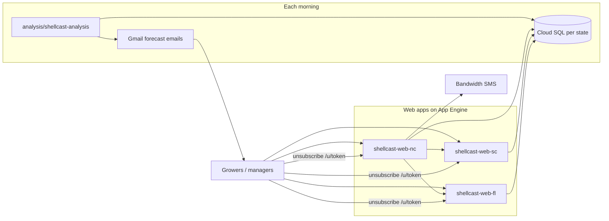

# ShellCast web documentation

Documentation for the **ShellCast web applications** — three Flask apps on Google App Engine (North Carolina, South Carolina, Florida) that growers and managers use in a browser.

Files are **numbered** (`01-` … `07-`) for a suggested reading order. **README.md** (this file) is the index.

## What the web apps do

ShellCast helps shellfish growers assess closure risk from rainfall forecasts. The **web** layer is where users:

- View closure **probabilities** on a map
- Sign in (Firebase) and manage **leases** and notification **preferences**
- Use **one-click email unsubscribe** (`/u/<token>`) from forecast messages

There is **one deployed app per state** (`shellcast-web-nc`, `shellcast-web-sc`, `shellcast-web-fl`), each with its own database. **Forecast emails** are sent from the **analysis** server; **SMS** is sent from the web stack (NC orchestrates FL/SC). See [03-NOTIFICATIONS.md](03-NOTIFICATIONS.md) and [docs/analysis/README.md](../analysis/README.md).

NC was built first; SC and FL were added by copying and adapting that codebase — see [02-STATE_APPS.md](02-STATE_APPS.md).

## Who should read what

| Audience | Start here |
|----------|------------|
| Project investigator, partner, or new team member | This page + [02-STATE_APPS.md](02-STATE_APPS.md) |
| Developer setting up a local web app | [01-GETTING_STARTED.md](01-GETTING_STARTED.md) |
| Understanding NC vs FL vs SC apps | [02-STATE_APPS.md](02-STATE_APPS.md) |
| SMS alerts, unsubscribe links, email vs web | [03-NOTIFICATIONS.md](03-NOTIFICATIONS.md) |
| Deploying to Google App Engine | [04-DEPLOY_GAE.md](04-DEPLOY_GAE.md) |
| Day-to-day code changes, commands, scripts | [05-DEVELOPMENT.md](05-DEVELOPMENT.md) (+ [05-development/](05-development/)) |
| Something broke (502, DB, host errors) | [06-TROUBLESHOOTING.md](06-TROUBLESHOOTING.md) |
| Full legacy setup detail (long reference) | [07-WEB_REFERENCE.md](07-WEB_REFERENCE.md) |

## Reading order

| # | Document | Purpose |
|---|----------|---------|
| — | **README.md** | Index and project context (this file) |
| 1 | [01-GETTING_STARTED.md](01-GETTING_STARTED.md) | First local run (developers) |
| 2 | [02-STATE_APPS.md](02-STATE_APPS.md) | Three state apps, URLs, shared vs different behavior |
| 3 | [03-NOTIFICATIONS.md](03-NOTIFICATIONS.md) | SMS (Bandwidth); email/unsubscribe split with analysis |
| 4 | [04-DEPLOY_GAE.md](04-DEPLOY_GAE.md) | Deploy to App Engine (NC first) |
| 5 | [05-DEVELOPMENT.md](05-DEVELOPMENT.md) | Development tasks; subsections in [05-development/](05-development/) (`COMMANDS.md`, `SCRIPTS_README.md`, …) |
| 6 | [06-TROUBLESHOOTING.md](06-TROUBLESHOOTING.md) | Common failures |
| 7 | [07-WEB_REFERENCE.md](07-WEB_REFERENCE.md) | Detailed legacy reference (structure, testing, contacts) |

## Repository layout

```
web/
  shellcast-web-nc/    # North Carolina (default service; SMS orchestrator)
  shellcast-web-sc/    # South Carolina
  shellcast-web-fl/    # Florida
```

Each app has its own `main.py`, `app.yaml`, `routes/`, `templates/`, `static/`, and `env.template` → local `.env`.

### Key dependency versions (web)

| Component | Version | Where defined |
|-----------|---------|---------------|
| OpenLayers (`ol`) | **9.2.4** | `web/shellcast-web-nc/package.json` |
| Cloud SQL Auth Proxy | **2.22.0** | `cloud-sql-proxy-setup.sh` |
| Python runtime (GAE) | **3.11** | Each app's `app.yaml` (`runtime: python311`) |

## Related documentation

- [docs/analysis/README.md](../analysis/README.md) — daily forecast analysis, database writes, **forecast email** sending
- [docs/DATABASE.md](../DATABASE.md) — Cloud SQL schemas
- [README.md](../../README.md) — Project overview and architecture
- [GETTING_STARTED.md](../../GETTING_STARTED.md) — Fork or clone, pre-commit, run locally

## System context



**Forecast emails** are sent from the **analysis** machine. **SMS** and **one-click email unsubscribe** are handled by the **web** apps. See [03-NOTIFICATIONS.md](03-NOTIFICATIONS.md).
